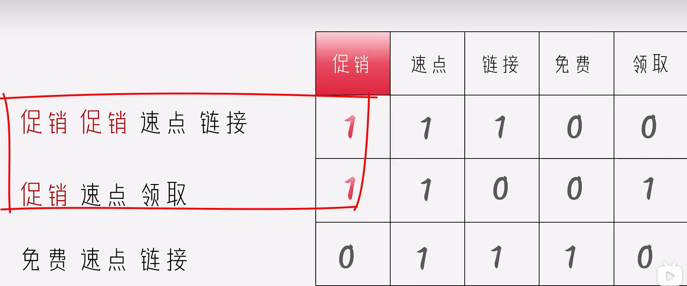
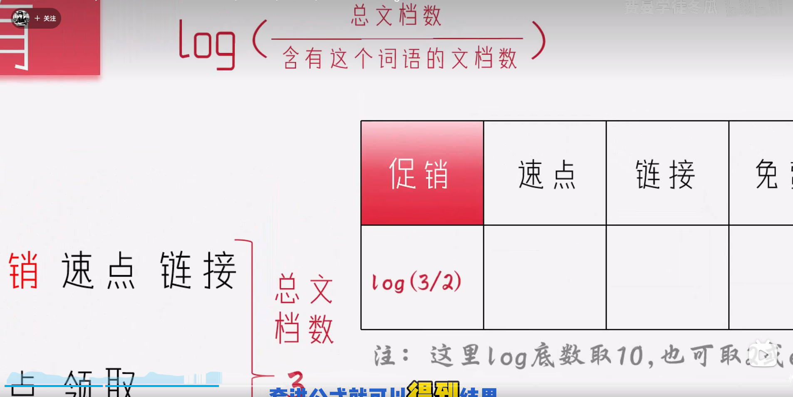
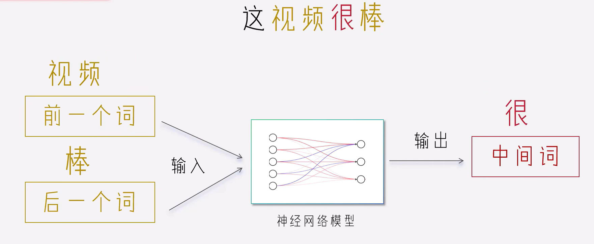
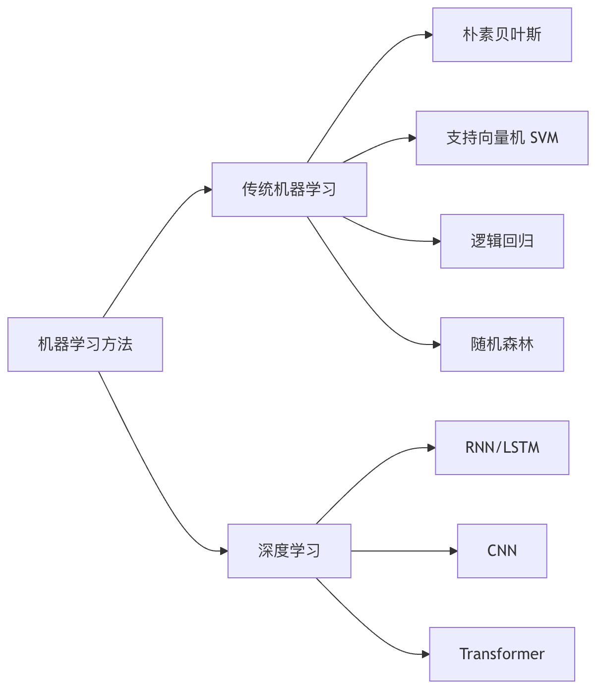

# 文本预处理
1. 基本流程图
原始文本->文本清洗->中文分词->去除停用词->(可选)词性标注/命名实体识别->文本向量化->用于模型训练和下游任务（分类，情感分析）
2. 文本清洗
    1. 处理编码格式
    2. 特殊字符处理：html标签，表情符号，控制字符，特殊标点
    3. 噪声去除：去除无关信息，处理拼写错误，标准化数字表示，统一日期格式
3. 分词：将文本分解为基本单元
    1. 英文分词方法
        1. 处理缩写
        2. 保留或合并特定短语
        3. 处理连字符
    2. 中文分词技术
        1. 基于字典分词：最大匹配法，最短路径法
        2. 基于统计的分词：HMM,CRF等序列标注方法
        3. 基于深度学习分词：BiLSTM-CRF,BERT等模型
    3. 子词分词
        1. 如果词表中没有，模型无法识别，需要将子词拆分出来。或词表膨胀
        2. 常用方法：Byte Pair Encoding(BPE):通过合并高频字符对构建子词。WordPiece:类似BPE，但基于概率合并。Unigram Language Model:从大词表中开始逐步删除低概率子词
    4. 常用分词工具对比
        1. jieba：基于前缀词典实现高效的词图扫描，生成句子中汉字所有可能成词情况所构成的有向无环图（DAG）
        2. NLTK：基于正则表达式和最大匹配实现，英文为主。
        3. spaCy：基于动态规划，多语言。
        4. Stanford CoreNLP：基于Java实现，多语言。
        5. HuggingFace Tokenizers：基于Python实现，多语言。
4. 词性标注：为分词结果中的每个词语标注其词性类别的过程。
    1. 常见词性体系：
        1. 英文常用Penn Treebank标签集：NN名词，VB动词，JJ形容词，RB副词，PRP代词
        2. 中文常用ICTCLAS标签集：n名词，v动词，a形容词,d副词,r代词
    2. 自动词性标注方法
        1. 基于规则：基于词典，规则，统计信息
        2. 基于统计：HMM,CRF等序列标注方法
        3. 基于深度学习：BiLSTM-CRF,BERT等模型

# 文本表示方法：
| 类别      | 方法                       | 特点                     | 举例                       |
| ------- | ------------------------ | ---------------------- | ------------------------ |
| ✅ 传统表示  | One-Hot                  | 稀疏、高维、无法表达语义           | “我” → \[0, 1, 0, 0, ...] |
| ✅ 传统表示  | Bag of Words（BoW）        | 统计词频，忽略顺序              | \[我:2, 喜欢:1, 你:1]        |
| ✅ 传统表示  | TF-IDF                   | 考虑词的重要性（文档频率）          | “重要词”权重高                 |
| ✅ 分布式表示 | Word2Vec                 | 每个词有语义向量，相似词接近         | “中国” ≈ “日本”              |
| ✅ 分布式表示 | GloVe                    | 全局统计信息，更稳定             | 类似 Word2Vec，但用词共现矩阵      |
| ✅ 上下文表示 | ELMo                     | 词向量考虑上下文变化             | “bank” 在不同句子中表示不同        |
| ✅ 上下文表示 | BERT                     | 基于Transformer，词级子词级都支持 | 强大的语义建模能力                |
| ✅ 句子级表示 | Sentence-BERT, CLS token | 可表示整个句子、文档             | “我喜欢你” → 向量（768维）        |
## BOW （有没有 有多少）

## TF-IDF (词袋法的升级，判断权重)
稀有性：IDF

词频：TF
每个词出现的次数/每个句子词总数
TF*IDF
## Word Embedding(词嵌入)
### Word2Vec(语义相似度)
    用前一个词和后一个词预测中间词

# 文本分类
1. 目的：将给定的文本分配到一个或多个预定义类别中
2. 常见场景
    情感分析：判断评论是正面还是负面
    垃圾邮件过滤：区分正常邮件还是垃圾邮件
    新闻分类：将新闻归类到体育，财经，科技等
    意图识别：理解用户查询的真实意图
    医疗诊断：根据症状描述分类疾病类型
3. 文本分类基本流程
    原始文本->文本预处理->特征提取->分类模型->分类结果
    1. 文本预处理
    ```py
    import re
    import nltk
    from nltk.corpus import stopwords
    from nltk.stem import PorterStemmer

    def preprocess_text(text):
        # 转换为小写
        text = text.lower()
        # 移除特殊字符和数字
        text = re.sub(r'[^a-zA-Z\s]', '', text)
        # 分词
        words = text.split()
        # 移除停用词
        stop_words = set(stopwords.words('english'))
        words = [word for word in words if word not in stop_words]
        # 词干提取
        stemmer = PorterStemmer()
        words = [stemmer.stem(word) for word in words]
        return ' '.join(words)
    ```
    2. 特征提取
    常见方法：词袋模型，TF-IDF，Word2Vec,BERT
    3. 分类模型
       1. 传统机器学习方法：朴素贝叶斯，支持向量机，逻辑回归，随机森林。
       2. 深度学习方法：卷积神经网络CNN，循环神经网络RNN/LSTM,Transformer(BERT等)
    4. demo
    ```py
    from sklearn.datasets import fetch_20newsgroups
    from sklearn.feature_extraction.text import TfidfVectorizer
    from sklearn.naive_bayes import MultinomialNB
    from sklearn.metrics import classification_report

    # 1. 加载数据：选取20类新闻组中的4个类别（无神论、基督教、图形学、医学）
    categories = ['alt.atheism', 'soc.religion.christian', 'comp.graphics', 'sci.med']
    newsgroups_train = fetch_20newsgroups(subset='train', categories=categories)  # 加载训练集
    newsgroups_test = fetch_20newsgroups(subset='test', categories=categories)    # 加载测试集

    # 2. 创建TF-IDF向量器：将文本转化为稀疏的数值特征，最多保留5000个词特征
    vectorizer = TfidfVectorizer(max_features=5000)

    # 3. 将训练集文本进行TF-IDF向量化（拟合 + 转换）
    X_train = vectorizer.fit_transform(newsgroups_train.data)

    # 4. 使用相同词表将测试集也转为向量（只transform，防止数据泄露）
    X_test = vectorizer.transform(newsgroups_test.data)

    # 5. 获取对应的标签（整数编码，如0,1,2,3）
    y_train = newsgroups_train.target
    y_test = newsgroups_test.target

    # 6. 创建并训练朴素贝叶斯分类器（适用于TF-IDF文本分类任务）
    clf = MultinomialNB()
    clf.fit(X_train, y_train)

    # 7. 在测试集上进行预测
    y_pred = clf.predict(X_test)

    # 8. 输出分类评估结果（精确率、召回率、F1分数）
    print(classification_report(y_test, y_pred, target_names=newsgroups_test.target_names))
    ```
    5. 处理类别不平衡可以尝试
       1. 重采样
       2. 使用类别权重
       3. 尝试不同的评估指标
    6. 提高模型性能的方法
       1. 特征工程
       2. 模型优化
       3. 数据增强 
# 情感分析
## 情感分析的基本类型
1. 按分析粒度分类
    1. 文档级情感分析：将整个文档作为一个整体判断情感倾向
    2. 句子级情感分析：分析单个句子的情感极性
    3. 方面级情感分析：针对文本中提到的特定方向进行情感判断
2. 按情感维度分类
    1. 二分类：正面/负面
    2. 三分类：正面/中性/负面
    3. 多分类：更细粒度的情感分类（如愤怒，高兴，悲伤等）
    4. 情感强度分析：量化情感的强烈程度
## 基于词典的情感分析方法
基于此单的方法是最传统的情感分析技术，主要依赖与构建的情感模型
1. 核心组件
   1. 情感词典：包含带有情感极性和强度的词语集合
   2. 强度调节器：处理程度副词和否定词的影响
2. 优点：无需训练数据，计算效率高，可解释性强
3. 缺点：难以处理复杂语言现象（嘲讽，反语等）依赖词典的覆盖度和张量，无法捕捉上下文语义
## 基于机器学习的情感分析方法
机器学习方法通过从标注数据中学习模式来进行情感分析
1. 典型特征工程
   1. 词袋模型：将文本表示为词频向量
   2. TF-IDF：考虑词语再文档中的重要性
   3. N-gram特征：捕获局部词语序列模型
   4. 情感词典特征：结合词典方法的优势
2. 常用算法

## 细粒度情感分析
ABSA是更高级的情感分析任务，在识别文本中提到的特定方面及其对应的情感。
1. ABSA的核心子任务
   1. 方面提取：识别文本中讨论的实体或属性
      1. 显式方式：手机的电池续航很好->电池
      2. 隐式方式：拍出来的照片很清晰->摄像头
   2. 情感分类：对每个识别出的方面进行情感判断。
# 命名实体识别
是自然语言处理中的一项基础任务，他的目标是识别文本中具有特定意义的实体，并将其分类到预定义的类别中。
1. 核心概念
   1. 命名实体：文本中表示特定对象的专有名词
   2. 实体类别：常见类型包括人名，地名，组织结构名，时间，日期，货币等。
2. 类比理解
把NER想象成文本中的"高亮标记"工具——就像你在阅读文档时用不同颜色的荧光笔标记不同类型的重要信息。
3. 应用场景
    1. 信息抽取
    2. 搜索引擎优化
    3. 客户支持
    4. 医疗领域
4. NER技术实现
   1. 基本方法
      1. 规则匹配：基于预定义规则和词典。
      2. 统计学习：使用传统机器学习模型。
      3. 深度学习
   2. 常用算法：
      1. 条件随机场CRF
      2. 双向LSTM
      3. BERT等预训练模型
   3. NER的评估指标
      1. 关键性能指标
        1. 精确率：预测正确的实体数量/预测的所有实体数量
        2. 召回率：预测正确的实体数量/实际的所有实体数量
        3. F1值：精确率和召回率的调和平均数
        举例：假设测试集有100个实体，系统识别出90个，其中80个正确，精确率 = 80/90 ≈ 89% 召回率 = 80/100 = 80% F1 = 2*(0.89*0.8)/(0.89+0.8) ≈ 84%
# 关系抽取
1. 关系抽取的核心要素
    1. 实体识别：首先需要识别文本中的命名实体
    2. 关系分类：然后判断这些实体之间存在什么类型的关系
    3. 关系表示：最后以结构化形式表示这些关系
2. 关系抽取的主要方法
   1. 基于规则的方法
    ```py
    # 示例：简单的规则匹配
    import re

    text = "马云创立了阿里巴巴"
    pattern = r"(.+?)创立了(.+?)"
    match = re.search(pattern, text)
    if match:
        print(f"创始人: {match.group(1)}, 公司: {match.group(2)}")
    ```
   2. 监督学习方法
   使用标注数据进行模型训练，常见算法包括：
   支持向量机，条件随机场，深度学习模型
   3. 半监督/远程监督方法
      1. 利用少量标注数据和大量未标注数据
      2. 远程监督：利用外部知识库
   4. 基于与训练语言模型的方法
   BERT GPT RoBERTa
   5. 关系抽取的关键技术
      1. 实体识别
         1. 命名实体识别
         2. 实体连接
      2. 关系分类
         1. 二元关系
         2. n元关系
         3. 关系层次结构
      3. 评估指标
         1. 精确率
         2. 召回率
         3. F1值
   6. 实践
# 基本概念
自然语言处理（NLP）作为人工智能领域的核心分支，致力于打破人类语言和机器理解之间的壁垒，构建高效的人机交互的桥梁。NLP的技术谱系涵盖从基础任务到高级应用的完整链条。基础层任务保罗中文分词，子词切分，词性标注等结构化解析，中层任务设计文本分类，实体识别，关系抽取，文本摘要等语义理解，高层任务则拓展至机器翻译，自动问答等跨模态交互。这些任务构成层级递进的技术栈，要求系统不仅具备表层语言符号处理能力，更要穿透语言的多维语义空间，精准捕捉语境依赖性，情感倾向性，文化隐喻等深层次语言特征。
# Embedding
## 什么是Embedding？为什么需要它
在语义空间中，意思相近的词语或句子，他们的坐标点在空间上距离很近
## Embedding如何工作？
早期的embedding如word2vec，glove主要关注词级别的表示，而采用transformer的模型能够生成上下文(context-aware)的embedding。意味着同一个词在不同句子中的embedding是不同的。
“我今天想吃一个苹果”
“苹果发布了最新的手机”
## 动手实践
```bash
#环境准备
pip install sentence-transformers torch
```
```py
#加载与训练模型
from sentence_transformers import  SentenceTransformer

model=SentenceTransformer('paraphrase-multilingual-MiniLM-L12-v2')
print('加载成功')
```
```py
#生成句子的embedding

sentences=['今天天气真不错',
           '我喜欢在阳光明媚的日子里散步',
           '这台笔记本电脑的性能如何',
           '新款的cpu和显卡配置都很高',]

embeddings=model.encode(sentences,normalize_embeddings=True)
print('embeddings维度',embeddings.shape)
print(embeddings[0][:10])
```
model.encode()函数返回一个二维数组，每一行代表一个句子的embedding，每一列代表一个维度。
embeddings.shape会显示矩阵形状，(4,384)表示我们有4个句子，每个句子都是embedding的384维向量。
normalize_embeddings=True表示将embedding归一化，使得每个句子的embedding的模长为1。
```py
#计算余弦相似度
#越接近1，表示两个句子语义越相似
#越接近0，表示语义不想管
#越接近-1，表示语义相反
similaritie_1_2=util.cos_sim(embeddings[0],embeddings[1])
similaritie_1_3=util.cos_sim(embeddings[0],embeddings[2])
print('相似度1-2：',similaritie_1_2.item())
print('相似度1-3：',similaritie_1_3.item())
相似度1-2： 0.582543134689331
相似度1-3： 0.17139336466789246
```