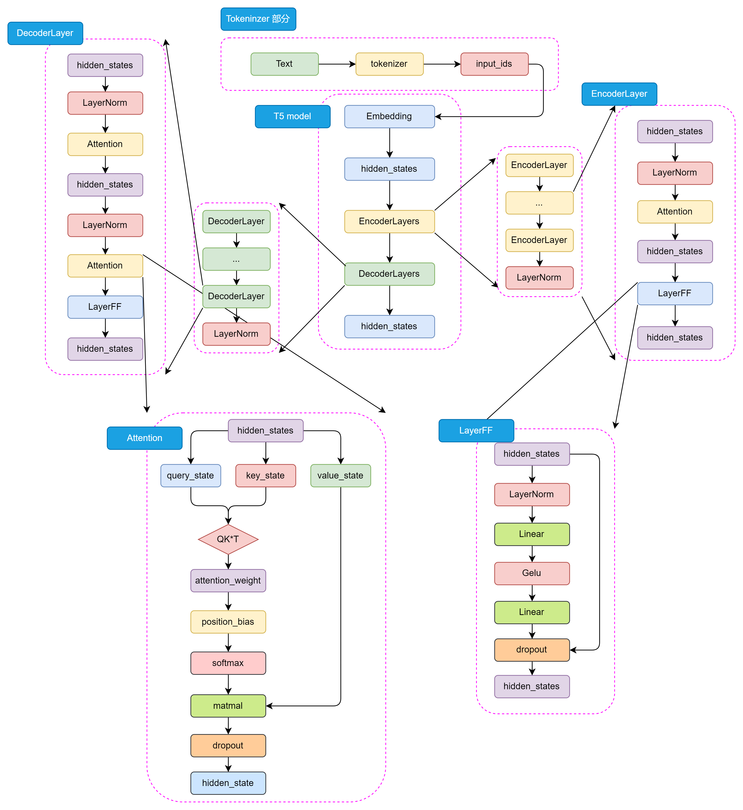
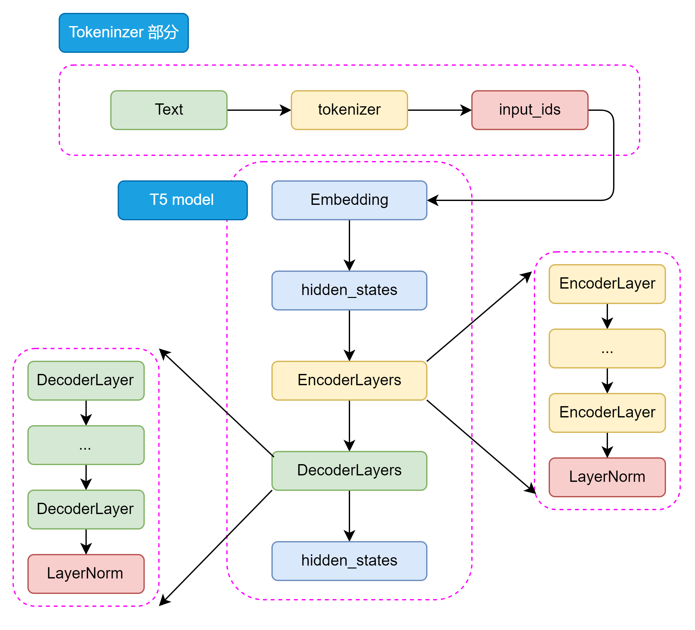
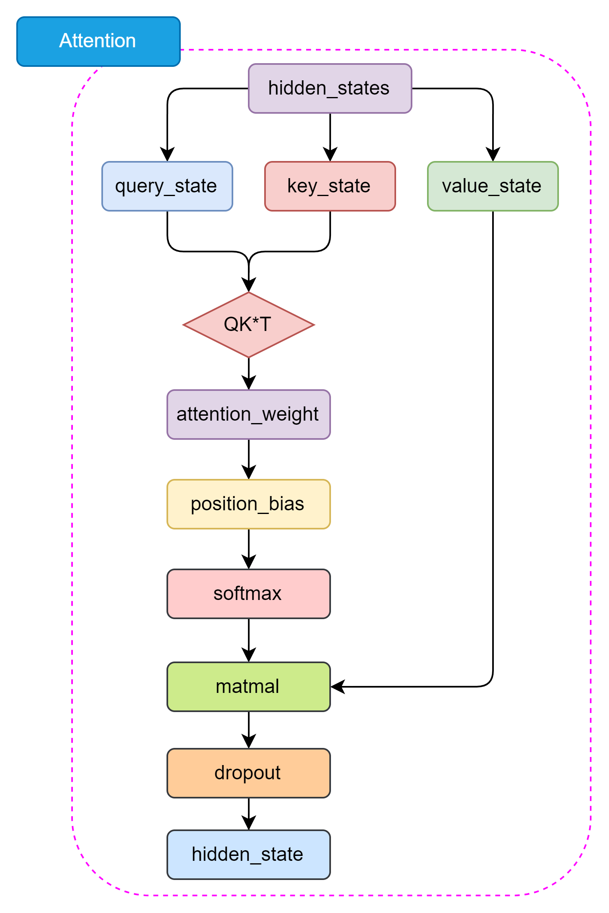
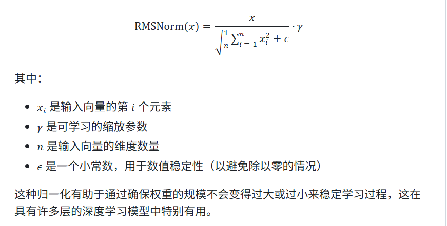

# 模型架构：Encoder-Decoder

从整体上看T5模型结构包括Tokenizer和Transformer部分。Tokenizer部分主要负责输入文本转换为模型可接受的输入部分，包括分词，编码等操作。Transformer部分又分为EncoderLayer和DecoderLayers两部分，他们分别由一个个小的Block组成，每个Block包含了多头注意力机制，前馈神经网络和Norm层。Block的设计可以使模型更加灵活像乐高一样。

T5的Encoder和Decoder部分都是基于Transformer架构设计的，主要包括self-attention和前馈神经网络两种结构。self-Attention用于捕捉输入序列中的全局依赖关系，前馈神经网络用于处理特征的非线性变换。
和Encoder不一样的是，在Decoder中还包含了Encoder-Decoder Attention结构，用于捕捉输入和输出序列之间的依赖关系，这两种Attention结构几乎完全一致，只有在位置编码和Mask机制上有所不同

T5的self-Attention和BERT的Attention机制一样

T5的layernorm采用了RMSNorm，通过计算每个神经元的均方根来归一化每个隐藏层的激活值
