# 注意力机制
## 什么是注意力机制
随着NLP从统计机器学习向深度学习迈进，作为NLP核心问题的文本表示方法也逐渐从统计学习向深度学习迈进。文本表示从最初的通过统计学习模型进行计算的向量空间模型，语言模型，通过word2vec的单层神经网络进入到通过神经网络学习文本表示的时代。但是从计算机视觉为起源发展起来的神经网络，其核心架构有三种：
1. 前馈神经网络（FNN）即网络中不存在环路，信息只能沿着层次从输入->输出单向流动，不会出现循环或反馈
    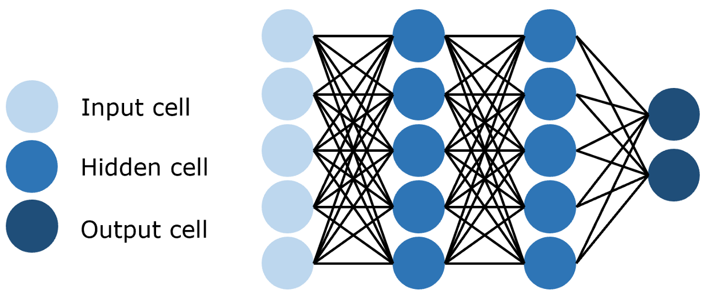
2. 卷积神经网络，即训练参数量远小于前馈神经网络的卷积层来进行特征提取和学习
   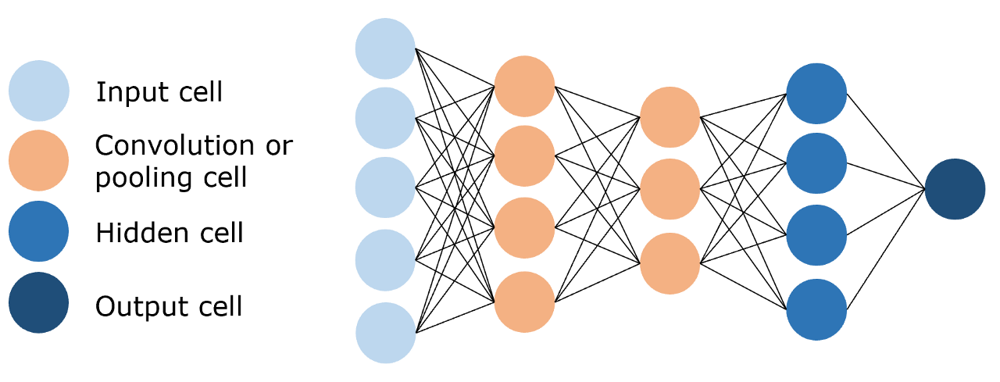
3. 循环神经网络，能够使用历史信息作为输入，包含环和自重复的网络
   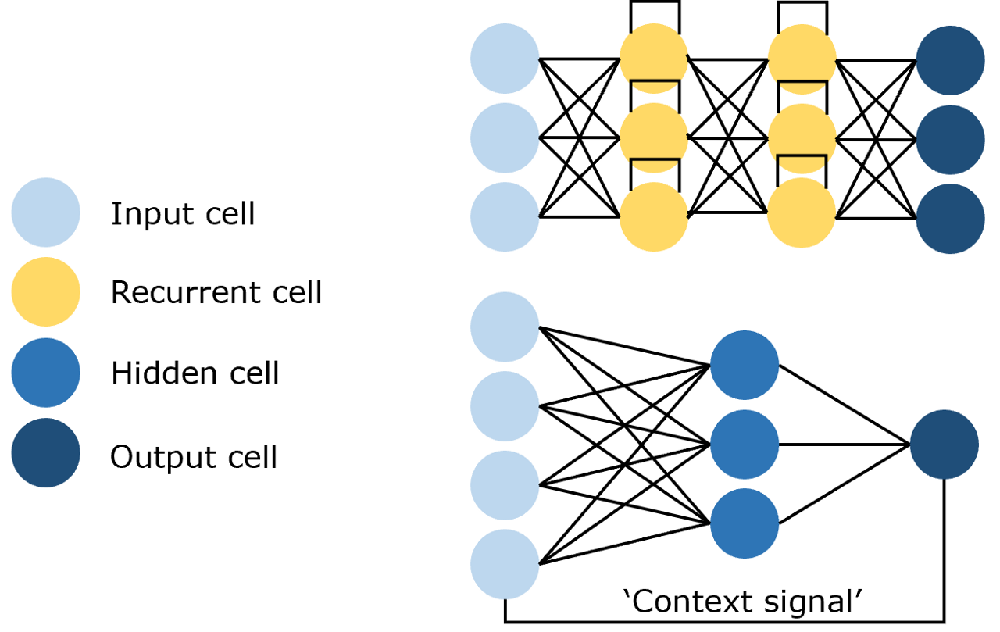
由于NLP任务所需要处理的文本往往是数列，因此专用于处理序列，时序数据的RNN往往能够在NLP任务上取得最优的效果。但无论是何种神经网络，都存在特定的缺陷。
1. 序列依序计算的模式能够很好地模拟时序信息，但限制了计算机并行计算的能力，由于序列需要依次输入，一次计算，GPU并行计算的能力收到了极大的限制。
2. 难以捕捉长序列的相关关系。距离越远的输入之间的关系就越南被捕捉，同时RNN需要将整个序列读入内存以此计算，也限制了序列的长度
那么什么是注意力机制？
注意力机制最先源于计算机视觉领域，其核心思想为当我们关注一张图片，我们往往无需看清楚全部内容而仅将注意力集中在重点部分即可。而在自然语言处理领域，我们往往也可以通过将重点注意力集中在一个或几个 token，从而取得更高效高质的计算效果。
注意力机制有三个核心变量：Query（查询值）、Key（键值）和 Value（真值）。我们可以通过一个案例来理解每一个变量所代表的含义。例如，当我们有一篇新闻报道，我们想要找到这个报道的时间，那么，我们的 Query 可以是类似于“时间”、“日期”一类的向量（为了便于理解，此处使用文本来表示，但其实际是稠密的向量），Key 和 Value 会是整个文本。通过对 Query 和 Key 进行运算我们可以得到一个权重，这个权重其实反映了从 Query 出发，对文本每一个 token 应该分布的注意力相对大小。通过把权重和 Value 进行运算，得到的最后结果就是从 Query 出发计算整个文本注意力得到的结果。
​具体而言，注意力机制的特点是通过计算 Query 与Key的相关性为真值加权求和，从而拟合序列中每个词同其他词的相关关系。
## 深入理解注意力机制
注意力机制有三个核心变量：
查询Query,键值key和真值Value，
接下来我们以字典为例，逐步分析注意力机制的计算公式。首先我们有这样一个字典
```python
{
    "apple":10,
    "banana":5,
    "chair":2
}
```
此时，字典的健就是注意力机制的键值key，而字典的值就是真值Value，字典支持我们进行精确的字符串匹配，例如，如果我们想要查找的值也就是查询值Query为”apple“，那么我们可以直接通过将Query与key做匹配来得到相应的Value,但是，如果我们想要匹配Query中包含多个key，例如，我们想要查找”fruit“，此时，我们应该将apple和banana都匹配到，但不能匹配到chair。因此，我们往往会选择将key对应的Value进行组合得到最终的Value
```py
{
    "apple":0.6,
    "banana":0.4,
    "chair":0
}
```
那么，我们最终查询到的值应该是value=0.6*10+0.4*5+0*2=8
给不同 Key 所赋予的不同权重，就是我们所说的注意力分数，也就是为了查询到 Query，我们应该赋予给每一个 Key 多少注意力。
通过训练拟合，让语义相似的词在空间中距离更近，我们通常用点积来进行度量：
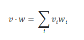
假设我们的Query为"fruit"，对应的词向量是q，key对应的词向量为
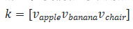
则，我们可以计算Query和每一个键的相似程度，然后可以通过softmax将其转换为和为1的权重
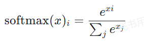
这样既可以反应Query和key的相似程度，同时又相加权重为1，也就是注意力分数，最后，我们再将得到的注意力分数和值向量做对应乘积即可。根据上述过程，我们就可以得到注意力机制计算的基本公式
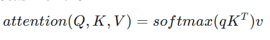
不过，此时的值还是一个标量，同时，我们此次只查询了一个Query,我们可以将值转换为$d_v$的向量，同时一次性查询多个Query，同样将多个Query对用的词向量堆叠在一起形成矩阵Q，得到公式
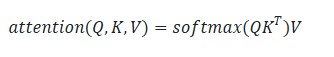
如果Q和K对应的维度$d_k$比较大，softmax放缩时就非常容易受到影响，使不同值之间的差异较大，从而影响梯度的稳定性。
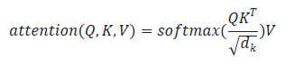
具体解释
因为是求点积，那么范围波动会比较大，所以要同时除以一个数
比方说投硬币，正面是+1，背面是-1，如果连续投掷$d_k$次，每次的值都是随机+1或-1，那么总和的范围会随着投掷次数$d_k$增大而增大，所以需要除以一个数，使得总和的范围不会随着$d_k$增大而增大，这个数就是$d_k$
为什么除以根号dk而非dk呢？
因为根号下dk是标准差，具体原因我也不知道，我只知道要放缩。(*)
## 注意力机制的实现
```py
'''注意力计算函数'''
def attention(query, key, value, dropout=None):
    '''
    args:
    query: 查询值矩阵
    key: 键值矩阵
    value: 真值矩阵
    '''
    # 获取键向量的维度，键向量的维度和值向量的维度相同
    d_k = query.size(-1)#query.size(-1)表示获取query的最后一个维度
    # 计算Q与K的内积并除以根号dk
    # transpose——相当于转置
    scores = torch.matmul(query, key.transpose(-2, -1)) / math.sqrt(d_k)#key.transpose(-2, -1)对key矩阵的最后两个维度进行转置
    # Softmax
    p_attn = scores.softmax(dim=-1)#在最后一个维度上应用softmax
    if dropout is not None:
        p_attn = dropout(p_attn)
        # 采样
     # 根据计算结果对value进行加权求和
    return torch.matmul(p_attn, value), p_attn

```
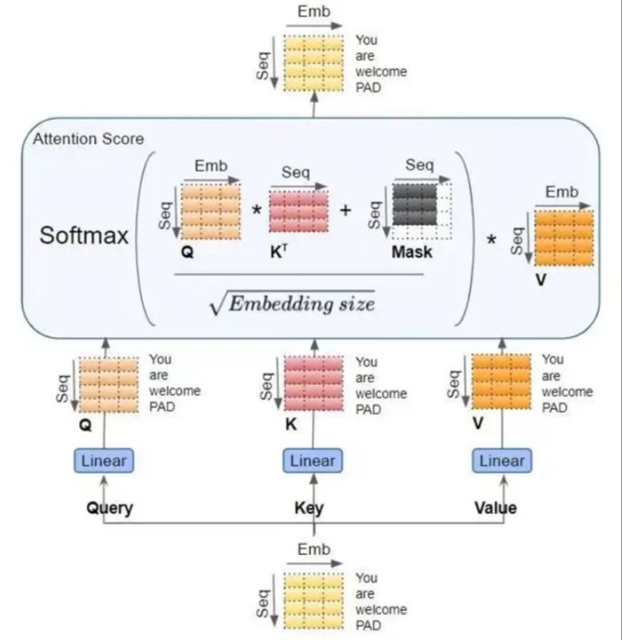
## 注意力机制的变种
### 自注意力机制
所谓自注意力机制，即是算本身序列中每个元素对其他元素的注意力分布，即在计算过程中，Q,K,V都由同一个输入通过不同的参数矩阵得到。在Encoder中，Q,K,V分别是输入对参数矩阵$W_Q,W_K,W_V$做积得到，从而拟合输入语句中每一个token对其他所有token关系。
实现：
```py
attention(x,x,x)
```
### 掩码自注意力
自注意力机制明确知道这句话有多少个单词，并且一次性给足，而掩码分批次，最后一次才给足。
为什么要用掩码自注意力？
防止信息泄露，在生成任务（如文本生成，翻译）中，模型必选顺序逐词生成，不能提前知道未来词。
<BOS> 【MASK】【MASK】【MASK】【MASK】
<BOS>    I   【MASK】 【MASK】【MASK】
<BOS>    I     like  【MASK】【MASK】
<BOS>    I     like    you  【MASK】
<BOS>    I     like    you   </EOS>

```py
# 创建一个上三角矩阵，用于遮蔽未来信息。
# 先通过 full 函数创建一个 1 * seq_len * seq_len 的矩阵
mask = torch.full((1, args.max_seq_len, args.max_seq_len), float("-inf"))
# triu 函数的功能是创建一个上三角矩阵
mask = torch.triu(mask, diagonal=1)
```
为什么生成 1 * seq_len * seq_len 的掩码矩阵？
掩码矩阵是固定的，与batch无关，生成一个1*seq_len*seq_len的矩阵，可以一次性计算所有batch的掩码（广播机制）。

```py
# 直接相加，mask会自动广播到batch_size
masked_scores = attention_scores + mask
```

生成的MASK矩阵是一个傻瓜三角矩阵，上三角元素均是-inf，其他位置元素置为0。在注意力计算时，我们会计算得到注意力分数与MASK矩阵的加和，再进行softmax操作

```py
# 此处的 scores 为计算得到的注意力分数，mask 为上文生成的掩码矩阵
scores = scores + mask[:, :seqlen, :seqlen]
scores = F.softmax(scores.float(), dim=-1).type_as(xq)
```

通过做求和，上三角区域（也就是应该被遮蔽的 token 对应的位置）的注意力分数结果都变成了 -inf，而下三角区域的分数不变。再做 Softmax 操作，-inf 的值在经过 Softmax 之后会被置为 0，从而忽略了上三角区域计算的注意力分数，从而实现了注意力遮蔽。

### 多头注意力
完整流程：
1. 输入投影，生成Q,K,V
   1. 输入张量形状（batch_size,seq_len,dim)
   2. 通过wq/wk/wv线性变换，输出形状变为：
    （batch_size,seq_len,n_heads*head_dim)
    例如：dim=512,n_heads=8,head_dim=64
    （batch_size,seq_len,8*64)
2. 拆成多头
    1. 物理拆分
        1. 将投影后的张量reshape为（batch_size,seq_len,n_heads,head_dim)，然后转置为（batch_size,n_heads,seq_len,head_dim)
        此时每个头独立处理：第i个头只能考到head_dim维的数据，但所有头并行计算
3. 注意力计算（每个头内）
    1. 每个头单独计算注意力
        1. $Q_i,K_i,V_i$的形状分别为(batch_size,seq_len,head_dim)
        2. 计算$Q_i x K_i^T$得到(batch_size,seq_len,seq_len)的注意力分数
        3. 对$V_i$加权求和，输出(batch_size,seq_len,head_dim)
4. 多头合并
    将所有头的输出拼接（concat）回原始维度：
(batch_size, seq_len, n_heads * head_dim) = (batch_size, seq_len, dim)
最后通过wo线性层调整输出。
```py
import torch.nn as nn
import torch


class MultiHeadAttention(nn.Module):
    def __init__(self,args:ModelArgs,is_causal=False):
        #构造函数
        #args:配置对象
        super().__init__()
        #隐藏层维度必须是头数的整数倍，因为后面我们会将输入拆成头数个矩阵
        assert args.dim % args.n_heads == 0
        #模型并行处理，默认为1
        model_parallel_size = 1
        #本地计算头数，等于总头数除以模型并行处理大小
        self.n_local_heads = args.n_heads // model_parallel_size
        #每个头的维度，等于模型维度除以头的总数
        self.head_dim = args.dim // args.n_heads

        #Wq、Wk、Wv 参数矩阵，每个参数矩阵为n_embd x n_embd
        #这里通过三个组合矩阵来代替了n个参数矩阵的组合，其逻辑在于矩阵内积再拼接其实等同于拼接好矩阵再内积
        self.wq=nn.Linear(args.dim,args.n_heads*self.head_dim,bias=False)
        self.wk=nn.Linear(args.dim,args.n_heads*self.head_dim,bias=False)
        self.wv=nn.Linear(args.dim,args.n_heads*self.head_dim,bias=False)
        #输出权重矩阵，维度为dim x n_embd(head_dim=n_embd/n_heads)
        self.wo=nn.Linear(args.n_heads*self.head_dim,args.dim,bias=False)
        #注意力的dropout
        self.dropout=nn.Dropout(args.dropout)
        #残差连接的dropout
        self.resid_pdrop=nn.Dropout(args.dropout)

        #创建一个上三角矩阵，用于遮蔽未来信息
        if is_causal:
            mask = torch.full((1, 1, args.max_seq_len, args.max_seq_len), float("-inf"))
            mask = torch.triu(mask, diagonal=1)
            # 注册为模型的缓冲区
            self.register_buffer("mask", mask)

    def forward(self, q: torch.Tensor, k: torch.Tensor, v: torch.Tensor):

        # 获取批次大小和序列长度，[batch_size, seq_len, dim]
        bsz, seqlen, _ = q.shape

        # 计算查询（Q）、键（K）、值（V）,输入通过参数矩阵层，维度为 (B, T, n_embed) x (n_embed, n_embed) -> (B, T, n_embed)
        xq, xk, xv = self.wq(q), self.wk(k), self.wv(v)

        # 将 Q、K、V 拆分成多头，维度为 (B, T, n_head, C // n_head)，然后交换维度，变成 (B, n_head, T, C // n_head)
        # 因为在注意力计算中我们是取了后两个维度参与计算
        # 为什么要先按B*T*n_head*C//n_head展开再互换1、2维度而不是直接按注意力输入展开，是因为view的展开方式是直接把输入全部排开，
        # 然后按要求构造，可以发现只有上述操作能够实现我们将每个头对应部分取出来的目标
        xq = xq.view(bsz, seqlen, self.n_local_heads, self.head_dim)
        xk = xk.view(bsz, seqlen, self.n_local_heads, self.head_dim)
        xv = xv.view(bsz, seqlen, self.n_local_heads, self.head_dim)
        xq = xq.transpose(1, 2)
        xk = xk.transpose(1, 2)
        xv = xv.transpose(1, 2)

        # 注意力计算
        # 计算 QK^T / sqrt(d_k)，维度为 (B, nh, T, hs) x (B, nh, hs, T) -> (B, nh, T, T)
        scores = torch.matmul(xq, xk.transpose(2, 3)) / math.sqrt(self.head_dim)
        # 掩码自注意力必须有注意力掩码
        if self.is_causal:
            assert hasattr(self, 'mask')
            # 这里截取到序列长度，因为有些序列可能比 max_seq_len 短
            scores = scores + self.mask[:, :, :seqlen, :seqlen]
        # 计算 softmax，维度为 (B, nh, T, T)
        scores = F.softmax(scores.float(), dim=-1).type_as(xq)
        # 做 Dropout
        scores = self.attn_dropout(scores)
        # V * Score，维度为(B, nh, T, T) x (B, nh, T, hs) -> (B, nh, T, hs)
        output = torch.matmul(scores, xv)

        # 恢复时间维度并合并头。
        # 将多头的结果拼接起来, 先交换维度为 (B, T, n_head, C // n_head)，再拼接成 (B, T, n_head * C // n_head)
        # contiguous 函数用于重新开辟一块新内存存储，因为Pytorch设置先transpose再view会报错，
        # 因为view直接基于底层存储得到，然而transpose并不会改变底层存储，因此需要额外存储
        output = output.transpose(1, 2).contiguous().view(bsz, seqlen, -1)

        # 最终投影回残差流。
        output = self.wo(output)
        output = self.resid_dropout(output)
        return output
```
多注意力机制解决了什么问题？一个词语在不同语境的含义不同
不必放在不同的batch中，只是为了并行
# Encoder-Decoder架构
在Transformer中，使用注意力机制的是其两个核心组件Encoder（编码器）和Decoder（解码器）
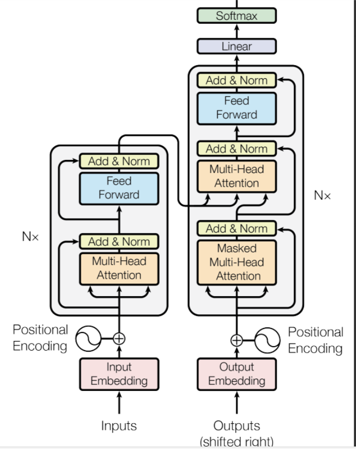
## Seq2Seq
即序列到序列模型，是一种经典NLP任务，具体而言，是指模型输入的是一个自然语言序列，输出的是另一个自然语言序列，例如机器翻译、对话生成等任务。例如，输入“我是一个学生”，翻译成“I am a student”就是经典的Seq2Seq任务。
对于Seq2Seq任务，一般的思路是对自然语言序列对编码再解码。所谓编码，就是讲输入的自然语言序列通过隐藏层编码成能够表征语义的向量，可以简单理解为更复杂的词向量表示。而解码，就是对输入的自然语言序列编码得到的向量通过隐藏层输出，再解码成对应的自然语言目标序列。通过编码再解码，就可以实现Seq2Seq任务。
Transformer中的Encoder，就是上述的编码过程，Decoder就是上述的解码过程。
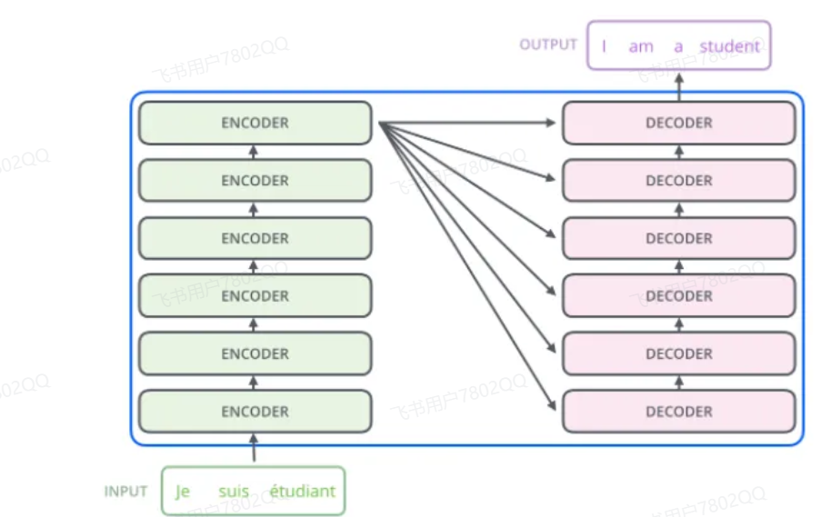
Transformer由Encoder和Decoder组成，每一个Encoder(Decoder)又由6个Encoder(Decoder)Layer组成。输入原序列会进入Encoder进行编码，然后Encoder Layer的最顶层再将编码结果输出给Decoder Layer的每一层，通过Decoder解码后就可以得到输出目标序列了。
接下来，我们将首先介绍Encoder和Decoder内部传统神经网络的经典结构，前馈神经网络FNN，归一化曾Layer Norm和残差链接Residual Connection，然后进一步分析Encoder和Decoder的内部结构。
### 前馈神经网络
每一层的神经元都和上下两层的每一个神经元完全链接的网络结构。每一个Encoder Layer都包含一个注意力机制和前馈神经网络
前馈神经网络实现较为简单
```py
class MLP(nn.Module):
    '''前馈神经网络'''

    def __init__(self, dim: int, hidden_dim: int, dropout: float):
        super().__init__()
        # 定义第一层线性变换，从输入维度到隐藏维度
        self.w1 = nn.Linear(dim, hidden_dim, bias=False)
        # 定义第二层线性变换，从隐藏维度到输入维度
        self.w2 = nn.Linear(hidden_dim, dim, bias=False)
        # 定义dropout层，用于防止过拟合
        self.dropout = nn.Dropout(dropout)

    def forward(self, x):
        # 前向传播函数
        # 首先，输入x通过第一层线性变换和RELU激活函数
        # 然后，结果乘以输入x通过第三层线性变换的结果
        # 最后，通过第二层线性变换和dropout层
        return self.dropout(self.w2(F.relu(self.w1(x))))

```
### 层归一化
1. 层归一化的计算方法
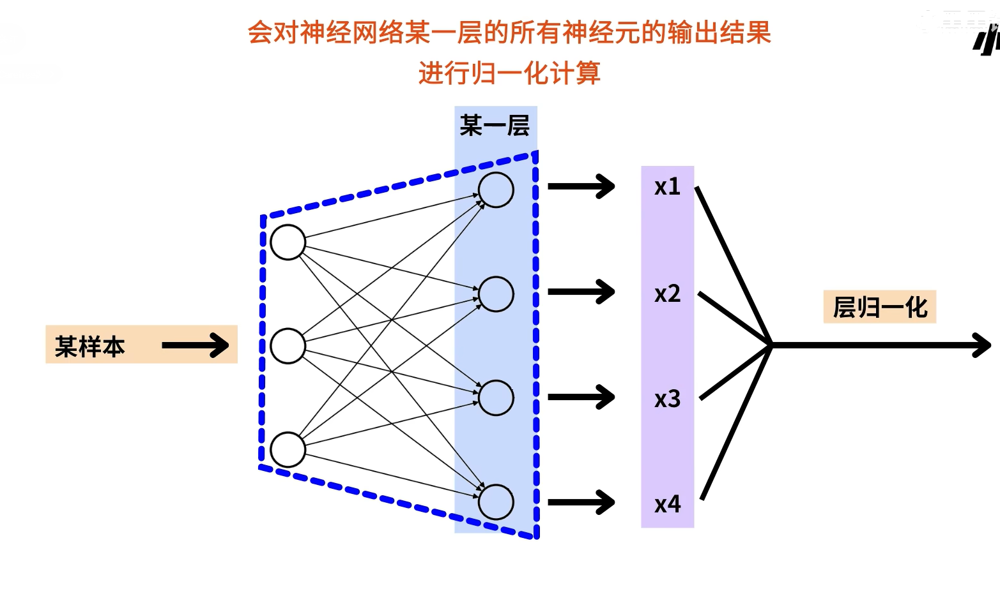
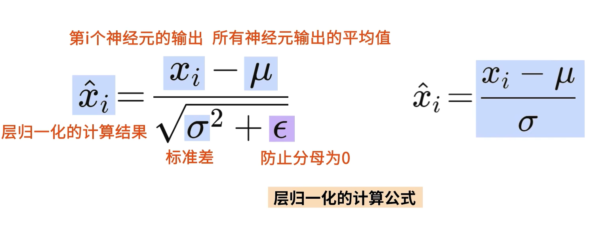
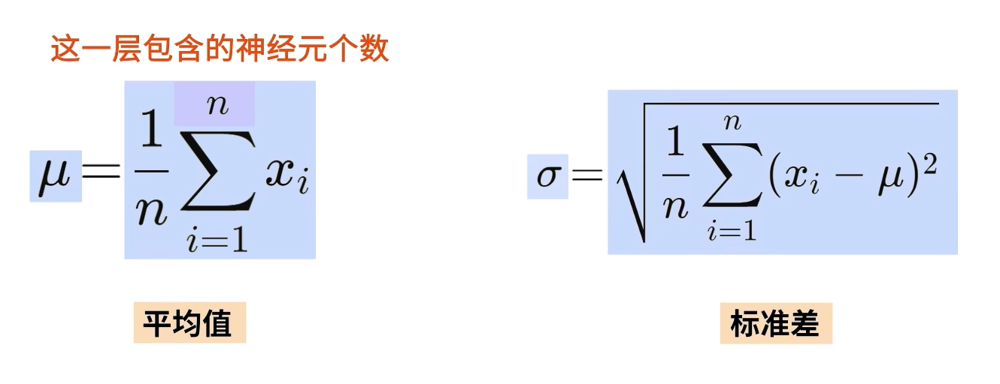
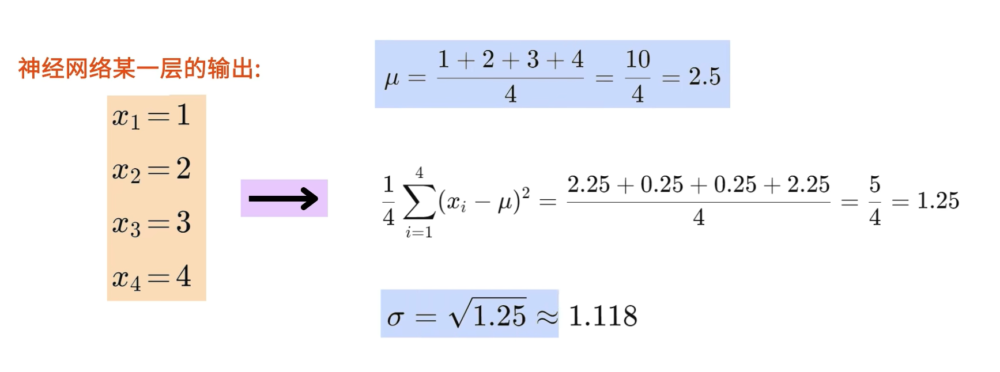
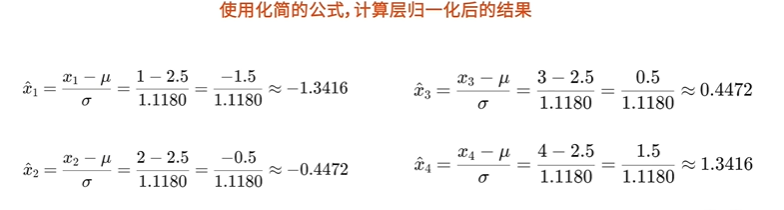
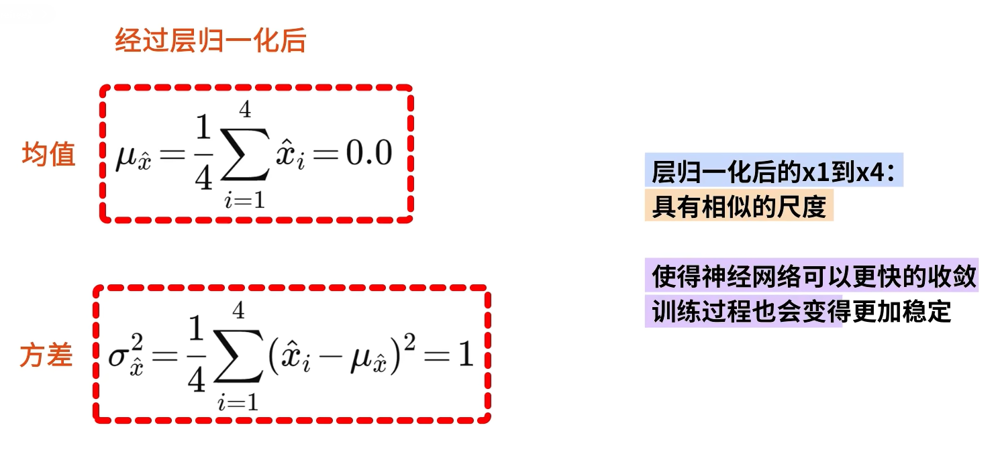
2. 如何使用层归一化
```py
   import torch
from torch import nn
#定义张量x
# x是一个2*4大小的张量，代表了2个样本，每个样本有4个特征
# 当使用层诡异化对x进行计算时，会对x的每一行的4个特征进行归一化
x=torch.tensor([[1.0,2.0,3.0,4.0],
                [1.0,1.0,1.0,1.0]])
# 定义层归一化实例
# 传入的参数4，表示层归一化的输入维度是4
# 也就是对应某一层的4个神经元的输出
layer_norm = nn.LayerNorm(4)
output=layer_norm(x)
print(output)
# tensor([[-1.3416, -0.4472,  0.4472,  1.3416],
#         [ 0.0000,  0.0000,  0.0000,  0.0000]],
#        grad_fn=<NativeLayerNormBackward0>)
```

3. 为什么Transformer使用层归一化
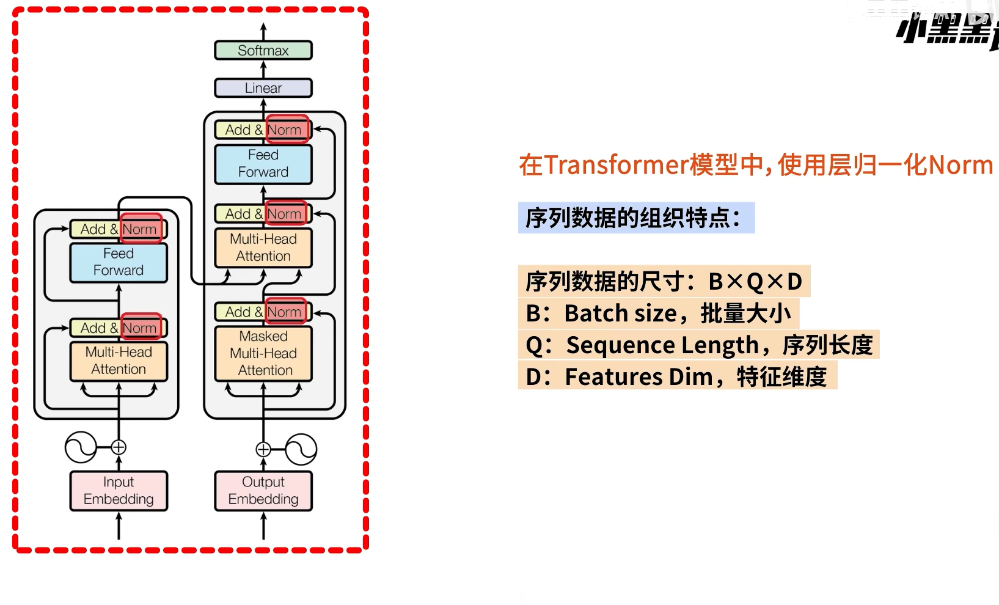
```py
import torch
import torch.nn as nn
# 当使用层归一化计算序列数据时，层归一化只会作用在最后的特征维度上
# 其中批量大小B与序列长度Q，这两个维度都不会影响层归一化的计算
# 定义输入数据 x，形状为（B,Q,D）->(2,3,4)
#2个样本，每个样本3个单词，每个单词用4个维度表示
x=torch.tensor([
    #第一个样本
    [[1.0,2.0,3.0,4.0],#第一个单词的四个维度
     [1.0,1.0,1.0,1.0],#第二个单词的四个维度
     [1.0,1.0,1.0,1.0]],
    #第二个样本
    [[1.0,1.0,1.0,1.0],#第一个单词的四个维度
     [1.0,1.0,1.0,1.0],#第二个单词的四个维度
     [1.0,1.0,1.0,1.0]]
])
# 初始化层归一化层
layer_norm = nn.LayerNorm(4)
# x输入至层归一化层
output=layer_norm(x)
print(output)
# tensor([[[-1.3416, -0.4472,  0.4472,  1.3416],
#          [ 0.0000,  0.0000,  0.0000,  0.0000],
#          [ 0.0000,  0.0000,  0.0000,  0.0000]],
# 
#         [[ 0.0000,  0.0000,  0.0000,  0.0000],
#          [ 0.0000,  0.0000,  0.0000,  0.0000],
#          [ 0.0000,  0.0000,  0.0000,  0.0000]]],
#        grad_fn=<NativeLayerNormBackward0>)
```
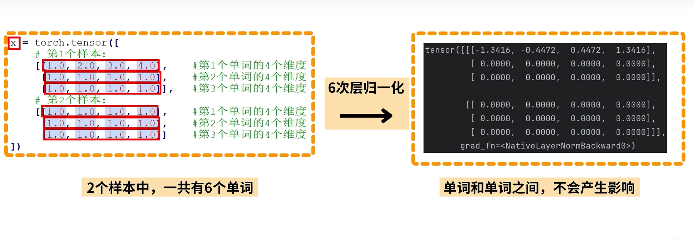
4. 层归一化与批归一化的区别(*)
### 残差链接
传统网络：必须按步骤来（切菜->炒菜->调味->装盘），如果某一步有问题，整个菜就毁了
残差链接：允许你跳过某些步骤（比如调味不会，直接装盘）
最终结果=你的操作+原始食材

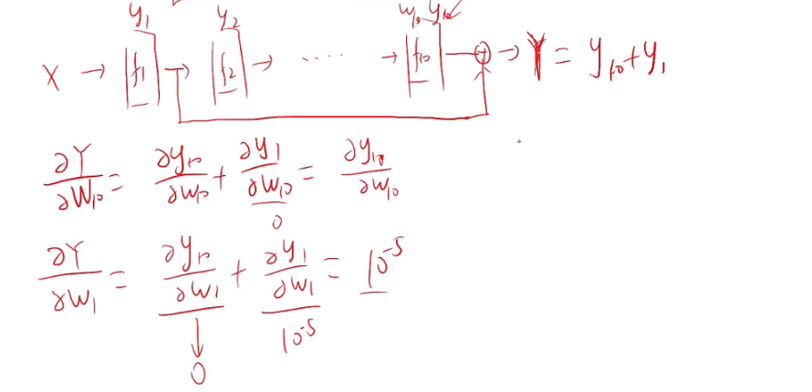
### 位置编码
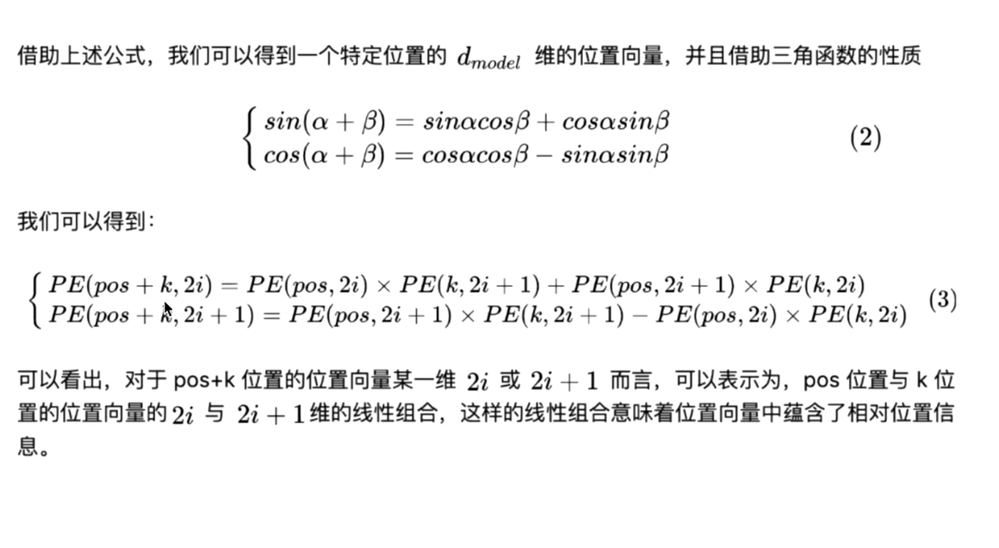
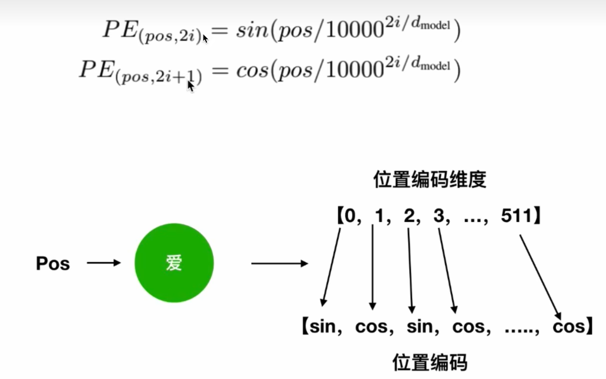

### Encoder
编码器就是让计算机合理的认识人类世界的客观存在的东西
在实现上述组件之后，我们可以搭建起Transformer的Encoder。Encoder由N个Encoder Layer组成，每一个Encoder Layer包括一个注意力层和一个前馈神经网络。因此，我们首先实现一个Encoder Layer。
编码器包括两个子层，self-Attention,Feed Forward
每一个子层的传输过程中都会有一个 残差网络+归一化
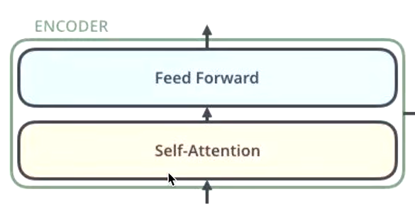
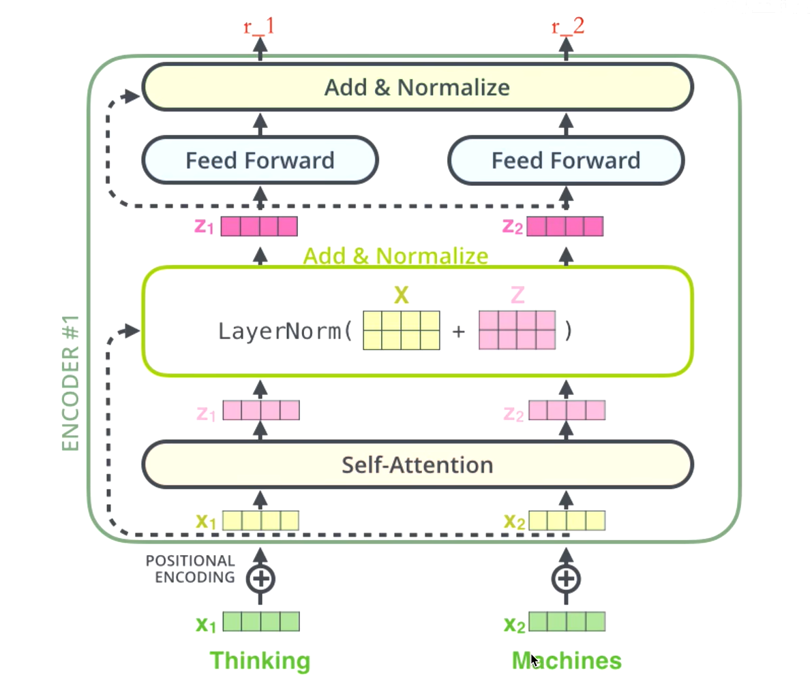
thinking
->得到绿色的x1(词向量，可以通过one-hot,word2vec,得到)+叠加位置编码）（给x1赋予位置属性）得到黄色x1
->输入到self-attention子层中，做注意力机制(x1,x2拼接起来的一句话做)，得到z1（x1与x1,x2拼接起来的句子做了自注意力机制的词向量，表征仍然是thinking），也就是说z1拥有了位置特征，句法特征，语义特征的词向量
->残差网络（避免梯度消失）层归一化，做标准化（避免梯度爆炸），限制区间，得到深粉色的z1
->feedforward，relu（w2(s1x+b1)+b2）(前边的每一步都在做线性变换，wx+b，线性变换的叠加永远都是线性变化（线性变换就是放缩和平移），通过feed forward中的Relu激活函数，将线性变换变成非线性变换，这样的空间变换可以无限你和任何一种状态)，得到r1(是thinking的新的表征)
### Decoder
解码器会接受编码器生成的词向量，然后通过这个词向量去生成翻译的结果。
标准的解码器有N个相同的block堆叠
每个解码器block由3个子层
1. Masked Multi-Head Attention
    1. 输入是前面的输出序列（例如：目标语言的前几个词）
    2. 使用掩码(mask)防止解码器看到将来要预测的词（智能看自己和前面的词）
    3. 保证词是逐步的，因果的
2. Encoder-Decoder Multi-Head Attention 
    1. Query来自解码器上层的输出，key和Value来自编码器的输出。
    2. 让解码器“对齐”编码器的上下文，比如让它知道源语言句子的结构和意义
3. Feed Forward Network 
    1. 与编码器中的Feed Forward Network相同
4. 每个子层后边都有残差链接+层归一化
### 总结
#### 1. 为什么Decoder需要Masked Multi-Head Attention
推理阶段 ≈ 高考（真实考试）
考题未知，必须独立解答
每一道题（即每一个词）必须根据前面写下的答案来推理下一个
不能提前看答案
不能修改已答的内容
模型此时必须“靠真本事”一个一个生成，完全不能看未来词
训练阶段 ≈ 模拟考试 + 改错 + 调参
我们提前知道“标准答案”（Ground Truth）
模型尝试自己写答案（即预测下一个词）
同时我们告诉它正确答案是什么，让它对比差距（计算 loss）
如果“答错了”（loss 大），我们就“修改模型参数”（反向传播+优化）
# 手撕Transformer代码(复制别人的)
```py
#!/usr/bin/python3.9
# -*- coding: utf-8 -*-
# @Time    : 2021/10/29 10:48
# @Author  : nickchen121
# @Email   : nickchen121@163.com
# Cnblogs : https://www.cnblogs.com/nickchen121
# @File    : abd_transformer_cyd.py
# @Software: PyCharm


import math
import torch
import collections
import numpy as np
import torch.nn as nn
from copy import deepcopy
import torch.nn.functional as F
from torch.autograd import Variable

# 让Hypothesis拥有可访问的属性，即Hypothesis.value
Hypothesis = collections.namedtuple('Hypothesis', ['value', 'score'])


def clone_module_to_modulelist(module, module_num):
    """
    克隆n个Module类放入ModuleList中，并返回ModuleList，这个ModuleList中的每个Module都是一模一样的
    nn.ModuleList，它是一个储存不同 module，并自动将每个 module 的 parameters 添加到网络之中的容器。
    你可以把任意 nn.Module 的子类 (比如 nn.Conv2d, nn.Linear 之类的) 加到这个 list 里面，
    加入到 nn.ModuleList 里面的 module 是会自动注册到整个网络上的，
    同时 module 的 parameters 也会自动添加到整个网络中。
    :param module: 被克隆的module
    :param module_num: 被克隆的module数
    :return: 装有module_num个相同module的ModuleList
    """
    return nn.ModuleList([deepcopy(module) for _ in range(module_num)])


class LayerNorm(nn.Module):
    """
    构建一个LayerNorm Module
    LayerNorm的作用：对x归一化，使x的均值为0，方差为1
    LayerNorm计算公式：x-mean(x)/\sqrt{var(x)+\epsilon} = x-mean(x)/std(x)+\epsilon
    """

    def __init__(self, x_size, eps=1e-6):
        """
        :param x_size: 特征的维度
        :param eps: eps是一个平滑的过程，取值通常在（10^-4~10^-8 之间）
        其含义是，对于每个参数，随着其更新的总距离增多，其学习速率也随之变慢。
        防止出现除以0的情况。

        nn.Parameter将一个不可训练的类型Tensor转换成可以训练的类型parameter，
        并将这个parameter绑定到这个module里面。
        使用这个函数的目的也是想让某些变量在学习的过程中不断的修改其值以达到最优化。
        """
        super(LayerNorm, self).__init__()
        self.ones_tensor = nn.Parameter(torch.ones(x_size))  # 按照特征向量大小返回一个全1的张量，并且转换成可训练的parameter类型
        self.zeros_tensor = nn.Parameter(torch.zeros(x_size))
        self.eps = eps

    def forward(self, x):
        mean = x.mean(-1, keepdim=True)
        std = x.std(-1, keepdim=True)  # 求标准差
        return self.ones_tensor * (x - mean) / (std + self.eps) + self.zeros_tensor  # LayerNorm的计算公式


class FeatEmbedding(nn.Module):
    """
    视频特征向量生成器
    """

    def __init__(self, d_feat, d_model, dropout):
        """
        FeatEmbedding的初始化
        :param d_feat: per frame dimension（每帧的维度），作为Linear层输入的维度
        :param d_model: 作为Linear层输出的维度
        :param dropout: Dropout层的比率

        nn.Sequential：这是一个有顺序的容器，将特定神经网络模块按照在传入构造器的顺序依次被添加到计算图中
        在这里构造的容器是：LayerNorm --> Dropout --> Linear
        """
        super(FeatEmbedding, self).__init__()
        self.video_embeddings = nn.Sequential(
            # TODO:为什么这里对视频做处理，即图片做处理，不使用BatchNorm
            # nn.BatchNorm2d(d_feat)
            # nn.LayerNorm(d_feat),
            LayerNorm(d_feat),
            nn.Dropout(p=dropout),
            nn.Linear(d_feat, d_model)
        )

    def forward(self, x):
        return self.video_embeddings(x)  # 返回被处理后的视频特征向量


class WordEmbedding(nn.Module):
    """
    把向量构造成d_model维度的词向量，以便后续送入编码器
    """

    def __init__(self, vocab_size, d_model):
        """
        :param vocab_size: 字典长度
        :param d_model: 词向量维度
        """
        super(WordEmbedding, self).__init__()
        self.d_model = d_model
        # 字典中有vocab_size个词，词向量维度是d_model，每个词将会被映射成d_model维度的向量
        self.embedding = nn.Embedding(vocab_size, d_model)
        self.embed = self.embedding

    def forward(self, x):
        # TODO：为什么要乘以一个sqrt，Transformer中的？
        return self.embed(x) * math.sqrt(self.d_model)


class PositionalEncoding(nn.Module):
    """
    正弦位置编码，即通过三角函数构建位置编码

    Implementation based on "Attention Is All You Need"
    :cite:`DBLP:journals/corr/VaswaniSPUJGKP17`
    """

    def __init__(self, dim: int, dropout: float, max_len=5000):
        """
        :param dim: 位置向量的向量维度，一般与词向量维度相同，即d_model
        :param dropout: Dropout层的比率
        :param max_len: 句子的最大长度
        """
        # 判断能够构建位置向量
        if dim % 2 != 0:
            raise ValueError(f"不能使用 sin/cos 位置编码，得到了奇数的维度{dim:d}，应该使用偶数维度")

        """
        构建位置编码pe
        pe公式为：
        PE(pos,2i/2i+1) = sin/cos(pos/10000^{2i/d_{model}})
        """
        pe = torch.zeros(max_len, dim)  # 初始化pe
        position = torch.arange(0, max_len).unsqueeze(1)  # 构建pos，为句子的长度，相当于pos
        div_term = torch.exp((torch.arange(0, dim, 2, dtype=torch.float) * torch.tensor(
            -(math.log(10000.0) / dim))))  # 复现位置编码sin/cos中的公式
        pe[:, 0::2] = torch.sin(position.float() * div_term)  # 偶数使用sin函数
        pe[:, 1::2] = torch.cos(position.float() * div_term)  # 奇数使用cos函数
        pe = pe.unsqueeze(1)  # 扁平化成一维向量

        super(PositionalEncoding, self).__init__()
        self.register_buffer('pe', pe)  # pe不是模型的一个参数，通过register_buffer把pe写入内存缓冲区，当做一个内存中的常量
        self.drop_out = nn.Dropout(p=dropout)
        self.dim = dim

    def forward(self, emb, step=None):
        """
        词向量和位置编码拼接并输出
        :param emb: 词向量序列（FloatTensor），``(seq_len, batch_size, self.dim)``
        :param step: 如果 stepwise("seq_len=1")，则用此位置的编码
        :return: 词向量和位置编码的拼接
        """
        emb = emb * math.sqrt(self.dim)
        if step is None:
            emb = emb + self.pe[:emb.size(0)]  # 拼接词向量和位置编码
        else:
            emb = emb + self.pe[step]
        emb = self.drop_out(emb)
        return emb


def self_attention(query, key, value, dropout=None, mask=None):
    """
    自注意力计算
    :param query: Q
    :param key: K
    :param value: V
    :param dropout: drop比率
    :param mask: 是否mask
    :return: 经自注意力机制计算后的值
    """
    d_k = query.size(-1)  # 防止softmax未来求梯度消失时的d_k
    # Q,K相似度计算公式：\frac{Q^TK}{\sqrt{d_k}}
    scores = torch.matmul(query, key.transpose(-2, -1)) / math.sqrt(d_k)  # Q,K相似度计算
    # 判断是否要mask，注：mask的操作在QK之后，softmax之前
    if mask is not None:
        """
        scores.masked_fill默认是按照传入的mask中为1的元素所在的索引，
        在scores中相同的的索引处替换为value，替换值为-1e9，即-(10^9)
        """
        # mask.cuda()
        # 进行mask操作，由于参数mask==0，因此替换上述mask中为0的元素所在的索引

    scores = scores.masked_fill(mask == 0, -1e9)

    self_attn_softmax = F.softmax(scores, dim=-1)  # 进行softmax
    # 判断是否要对相似概率分布进行dropout操作
    if dropout is not None:
        self_attn_softmax = dropout(self_attn_softmax)

    # 注意：返回经自注意力计算后的值，以及进行softmax后的相似度（即相似概率分布）
    return torch.matmul(self_attn_softmax, value), self_attn_softmax


class MultiHeadAttention(nn.Module):
    """
    多头注意力计算
    """

    def __init__(self, head, d_model, dropout=0.1):
        """
        :param head: 头数
        :param d_model: 词向量的维度，必须是head的整数倍
        :param dropout: drop比率
        """
        super(MultiHeadAttention, self).__init__()
        assert (d_model % head == 0)  # 确保词向量维度是头数的整数倍
        self.d_k = d_model // head  # 被拆分为多头后的某一头词向量的维度
        self.head = head
        self.d_model = d_model

        """
        由于多头注意力机制是针对多组Q、K、V，因此有了下面这四行代码，具体作用是，
        针对未来每一次输入的Q、K、V，都给予参数进行构建
        其中linear_out是针对多头汇总时给予的参数
        """
        self.linear_query = nn.Linear(d_model, d_model)  # 进行一个普通的全连接层变化，但不修改维度
        self.linear_key = nn.Linear(d_model, d_model)
        self.linear_value = nn.Linear(d_model, d_model)
        self.linear_out = nn.Linear(d_model, d_model)

        self.dropout = nn.Dropout(p=dropout)
        self.attn_softmax = None  # attn_softmax是能量分数, 即句子中某一个词与所有词的相关性分数， softmax(QK^T)

    def forward(self, query, key, value, mask=None):
        if mask is not None:
            """
            多头注意力机制的线性变换层是4维，是把query[batch, frame_num, d_model]变成[batch, -1, head, d_k]
            再1，2维交换变成[batch, head, -1, d_k], 所以mask要在第二维（head维）添加一维，与后面的self_attention计算维度一样
            具体点将，就是：
            因为mask的作用是未来传入self_attention这个函数的时候，作为masked_fill需要mask哪些信息的依据
            针对多head的数据，Q、K、V的形状维度中，只有head是通过view计算出来的，是多余的，为了保证mask和
            view变换之后的Q、K、V的形状一直，mask就得在head这个维度添加一个维度出来，进而做到对正确信息的mask
            """
            mask = mask.unsqueeze(1)

        n_batch = query.size(0)  # batch_size大小，假设query的维度是：[10, 32, 512]，其中10是batch_size的大小

        """
        下列三行代码都在做类似的事情，对Q、K、V三个矩阵做处理
        其中view函数是对Linear层的输出做一个形状的重构，其中-1是自适应（自主计算）
        从这种重构中，可以看出，虽然增加了头数，但是数据的总维度是没有变化的，也就是说多头是对数据内部进行了一次拆分
        transopose(1,2)是对前形状的两个维度(索引从0开始)做一个交换，例如(2,3,4,5)会变成(2,4,3,5)
        因此通过transpose可以让view的第二维度参数变成n_head
        假设Linear成的输出维度是：[10, 32, 512]，其中10是batch_size的大小
        注：这里解释了为什么d_model // head == d_k，如若不是，则view函数做形状重构的时候会出现异常
        """
        query = self.linear_query(query).view(n_batch, -1, self.head, self.d_k).transpose(1, 2)  # [b, 8, 32, 64]，head=8
        key = self.linear_key(key).view(n_batch, -1, self.head, self.d_k).transpose(1, 2)  # [b, 8, 28, 64]
        value = self.linear_value(value).view(n_batch, -1, self.head, self.d_k).transpose(1, 2)  # [b, 8, 28, 64]

        # x是通过自注意力机制计算出来的值， self.attn_softmax是相似概率分布
        x, self.attn_softmax = self_attention(query, key, value, dropout=self.dropout, mask=mask)

        """
        下面的代码是汇总各个头的信息，拼接后形成一个新的x
        其中self.head * self.d_k，可以看出x的形状是按照head数拼接成了一个大矩阵，然后输入到linear_out层添加参数
        contiguous()是重新开辟一块内存后存储x，然后才可以使用.view方法，否则直接使用.view方法会报错
        """
        x = x.transpose(1, 2).contiguous().view(n_batch, -1, self.head * self.d_k)
        return self.linear_out(x)


class FeedForward(nn.Module):
    """
    两层具有残差网络的前馈神经网络，FNN网络
    """

    def __init__(self, d_model: int, d_ff: int, dropout=0.1):
        """
        :param d_model: FFN第一层输入的维度
        :param d_ff: FNN第二层隐藏层输入的维度
        :param dropout: drop比率
        """
        super(FeedForward, self).__init__()
        self.w_1 = nn.Linear(d_model, d_ff)
        self.w_2 = nn.Linear(d_ff, d_model)
        self.layer_norm = nn.LayerNorm(d_model, eps=1e-6)
        self.dropout_1 = nn.Dropout(dropout)
        self.relu = nn.ReLU()
        self.dropout_2 = nn.Dropout(dropout)

    def forward(self, x):
        """
        :param x: 输入数据，形状为(batch_size, input_len, model_dim)
        :return: 输出数据（FloatTensor），形状为(batch_size, input_len, model_dim)
        """
        inter = self.dropout_1(self.relu(self.w_1(self.layer_norm(x))))
        output = self.dropout_2(self.w_2(inter))
        # return output + x，即为残差网络
        return output  # + x


class SublayerConnection(nn.Module):
    """
    子层的连接: layer_norm(x + sublayer(x))
    上述可以理解为一个残差网络加上一个LayerNorm归一化
    """

    def __init__(self, size, dropout=0.1):
        """
        :param size: d_model
        :param dropout: drop比率
        """
        super(SublayerConnection, self).__init__()
        self.layer_norm = LayerNorm(size)
        # TODO：在SublayerConnection中LayerNorm可以换成nn.BatchNorm2d
        # self.layer_norm = nn.BatchNorm2d()
        self.dropout = nn.Dropout(p=dropout)

    def forward(self, x, sublayer):
        return self.dropout(self.layer_norm(x + sublayer(x)))


class EncoderLayer(nn.Module):
    """
    一层编码Encoder层
    MultiHeadAttention -> Add & Norm -> Feed Forward -> Add & Norm
    """

    def __init__(self, size, attn, feed_forward, dropout=0.1):
        """
        :param size: d_model
        :param attn: 已经初始化的Multi-Head Attention层
        :param feed_forward: 已经初始化的Feed Forward层
        :param dropout: drop比率
        """
        super(EncoderLayer, self).__init__()
        self.attn = attn
        self.feed_forward = feed_forward

        """
        下面一行的作用是因为一个Encoder层具有两个残差结构的网络
        因此构建一个ModuleList存储两个SublayerConnection，以便未来对数据进行残差处理
        """
        self.sublayer_connection_list = clone_module_to_modulelist(SublayerConnection(size, dropout), 2)

    def forward(self, x, mask):
        """
        :param x: Encoder层的输入
        :param mask: mask标志
        :return: 经过一个Encoder层处理后的输出
        """
        """
        编码层第一层子层
        self.attn 应该是一个已经初始化的Multi-Head Attention层
        把Encoder的输入数据x和经过一个Multi-Head Attention处理后的x_attn送入第一个残差网络进行处理得到first_x
        """
        first_x = self.sublayer_connection_list[0](x, lambda x_attn: self.attn(x, x, x, mask))

        """
        编码层第二层子层
        把经过第一层子层处理后的数据first_x与前馈神经网络送入第二个残差网络进行处理得到Encoder层的输出
        """
        return self.sublayer_connection_list[1](first_x, self.feed_forward)


class DecoderLayer(nn.Module):
    """
    一层解码Decoder层
    Mask MultiHeadAttention -> Add & Norm -> Multi-Head Attention -> Add & Norm
    -> Feed Forward -> Add & Norm
    """

    def __init__(self, d_model, attn, feed_forward, sublayer_num, dropout=0.1):
        """
        :param d_model: d_model
        :param attn: 已经初始化的Multi-Head Attention层
        :param feed_forward: 已经初始化的Feed Forward层
        :param sublayer_num: 解码器内部子层数，如果未来r2l_memory传入有值，则为4层，否则为普通的3层
        :param dropout: drop比率
        """
        super(DecoderLayer, self).__init__()
        self.attn = attn
        self.feed_forward = feed_forward
        self.sublayer_connection_list = clone_module_to_modulelist(SublayerConnection(d_model, dropout), sublayer_num)

    def forward(self, x, l2r_memory, src_mask, trg_mask, r2l_memory=None, r2l_trg_mask=None):
        """
        :param x: Decoder的输入(captioning)
        :param l2r_memory: Encoder的输出，作为Multi-Head Attention的K，V值，为从左到右的Encoder的输出
        :param src_mask: 编码器输入的填充掩码
        :param trg_mask: 解码器输入的填充掩码和序列掩码，即对后面单词的掩码
        :param r2l_memory: 从右到左解码器的输出
        :param r2l_trg_mask: 从右到左解码器的输出的填充掩码和序列掩码
        :return: Encoder的输出
        """
        """
        解码器第一层子层
        把Decoder的输入数据x和经过一个Masked Multi-Head Attention处理后的first_x_attn送入第一个残差网络进行处理得到first_x
        """
        first_x = self.sublayer_connection_list[0](x, lambda first_x_attn: self.attn(x, x, x, trg_mask))

        """
        解码器第二层子层
        把第一层子层得到的first_x和
        经过一个Multi-Head Attention处理后的second_x_attn（由first_x和Encoder的输出进行自注意力计算）
        送入第二个残差网络进行处理
        """
        second_x = self.sublayer_connection_list[1](first_x,
                                                    lambda second_x_attn: self.attn(first_x, l2r_memory, l2r_memory,
                                                                                    src_mask))

        """
        解码器第三层子层
        把经过第二层子层处理后的数据second_x与前馈神经网络送入第三个残差网络进行处理得到Decoder层的输出
        
        如果有r2l_memory数据，则还需要经过一层多头注意力计算，也就是说会有四个残差网络
        r2l_memory是让Decoder层多了一层双向编码中从右到左的编码层
        而只要三个残差网络的Decoder层只有从左到右的编码
        """
        if not r2l_memory:
            # 进行从右到左的编码，增加语义信息
            third_x = self.sublayer_connection_list[-2](second_x,
                                                        lambda third_x_attn: self.attn(second_x, r2l_memory, r2l_memory,
                                                                                       r2l_trg_mask))
            return self.sublayer_connection_list[-1](third_x, self.feed_forward)
        else:
            return self.sublayer_connection_list[-1](second_x, self.feed_forward)


class Encoder(nn.Module):
    """
    构建n层编码层
    """

    def __init__(self, n, encoder_layer):
        """
        :param n: Encoder层的层数
        :param encoder_layer: 初始化的Encoder层
        """
        super(Encoder, self).__init__()
        self.encoder_layer_list = clone_module_to_modulelist(encoder_layer, n)

    def forward(self, x, src_mask):
        """
        :param x: 输入数据
        :param src_mask: mask标志
        :return: 经过n层Encoder处理后的数据
        """
        for encoder_layer in self.encoder_layer_list:
            x = encoder_layer(x, src_mask)
        return x


class R2LDecoder(nn.Module):
    """
    n个含有R2L自注意计算的解码层，该解码层只有3个残差网络
    """

    def __init__(self, n_layers, decoder_layer):
        """
        :param n_layers: Decoder层的层数
        :param decoder_layer: 初始化的Decoder层
        """
        super(R2LDecoder, self).__init__()
        self.decoder_layer_list = clone_module_to_modulelist(decoder_layer, n_layers)

    def forward(self, x, memory, src_mask, trg_mask):
        for decoder_layer in self.decoder_layer_list:
            # 没有传入r2l_memory和r2l_trg_mask，默认值为None，即该Decoder只有3个残差网络
            x = decoder_layer(x, memory, src_mask, trg_mask)
        return x


class L2RDecoder(nn.Module):
    """
    n个含有L2R自注意计算的解码层，该解码层有4个残差网络
    """

    def __init__(self, n_layers, decoder_layer):
        """
        :param n_layers: Decoder层的层数
        :param decoder_layer: 初始化的Decoder层
        """
        super(L2RDecoder, self).__init__()
        self.decoder_layer_list = clone_module_to_modulelist(decoder_layer, n_layers)

    def forward(self, x, memory, src_mask, trg_mask, r2l_memory, r2l_trg_mask):
        for decoder_layer in self.decoder_layer_list:
            # 传入r2l_memory和r2l_trg_mask，即修改默认值，Decoder将具有4个残差网络
            x = decoder_layer(x, memory, src_mask, trg_mask, r2l_memory, r2l_trg_mask)
        return x


def sequence_mask(size):
    """
    序列掩码，解码器输入数据时掩盖后续词的位置
    :param size: 生成词个数
    :return: 右上角为False，主对角线及左下角为True的bool矩阵
    """
    attn_shape = (1, size, size)
    """
    np.triu：返回函数的上三角矩阵A，k=1得到主对角线向上平移一个距离的对角线，
    即保留右上对角线及其以上的数据，其余置为0，即a_11=0
    """
    mask = np.triu(np.ones(attn_shape), k=1).astype('uint8')
    return (torch.from_numpy(mask) == 0).cuda()  # 通过==0返回的是bool矩阵，即矩阵元素为bool值


def src_trg_mask(src, r2l_trg, trg, pad_idx):
    """
    :param src: 编码器的输入
    :param r2l_trg: r2l方向解码器的输入
    :param trg: l2r方向解码器的输入
    :param pad_idx: pad的索引
    :return: trg为None，返回编码器输入的掩码；trg存在，返回编码器和解码器输入的掩码
    """

    # TODO: enc_src_mask是元组，是否可以改成list，然后修改这种冗余代码
    # 通过src的长短，即视频特征向量提取的模式，判断有多少种特征向量需要进行mask
    if isinstance(src, tuple) and len(src) == 4:
        # 不同模式的视频特征向量的mask
        src_image_mask = (src[0][:, :, 0] != pad_idx).unsqueeze(1)  # 二维特征向量
        src_motion_mask = (src[1][:, :, 0] != pad_idx).unsqueeze(1)  # 三维特征向量
        src_object_mask = (src[2][:, :, 0] != pad_idx).unsqueeze(1)  # 目标检测特征向量
        src_rel_mask = (src[3][:, :, 0] != pad_idx).unsqueeze(1)  # 目标关系特征向量

        # 视频所有特征向量mask的拼接
        enc_src_mask = (src_image_mask, src_motion_mask, src_object_mask, src_rel_mask)
        dec_src_mask = src_image_mask & src_motion_mask  # 视频二维和三维特征向量mask的拼接
        src_mask = (enc_src_mask, dec_src_mask)  # 视频最终的mask
    elif isinstance(src, tuple) and len(src) == 3:
        src_image_mask = (src[0][:, :, 0] != pad_idx).unsqueeze(1)
        src_motion_mask = (src[1][:, :, 0] != pad_idx).unsqueeze(1)
        src_object_mask = (src[2][:, :, 0] != pad_idx).unsqueeze(1)

        enc_src_mask = (src_image_mask, src_motion_mask, src_object_mask)
        dec_src_mask = src_image_mask & src_motion_mask
        src_mask = (enc_src_mask, dec_src_mask)
    elif isinstance(src, tuple) and len(src) == 2:
        src_image_mask = (src[0][:, :, 0] != pad_idx).unsqueeze(1)
        src_motion_mask = (src[1][:, :, 0] != pad_idx).unsqueeze(1)

        enc_src_mask = (src_image_mask, src_motion_mask)
        dec_src_mask = src_image_mask & src_motion_mask
        src_mask = (enc_src_mask, dec_src_mask)
    else:
        # 即只有src_image_mask，即二维特征的mask
        src_mask = src_image_mask = (src[:, :, 0] != pad_idx).unsqueeze(1)

    # 判断是否需要对trg，也就是解码器的输入进行掩码
    if trg and r2l_trg:
        """
        trg_mask是填充掩码和序列掩码，&前是填充掩码，&后是通过subsequent_mask函数得到的序列掩码
        其中type_as，是为了让序列掩码和填充掩码的维度一致
        """
        trg_mask = (trg != pad_idx).unsqueeze(1) & sequence_mask(trg.size(1)).type_as(src_image_mask.data)
        # r2l_trg的填充掩码
        r2l_pad_mask = (r2l_trg != pad_idx).unsqueeze(1).type_as(src_image_mask.data)
        # r2l_trg的填充掩码和序列掩码
        r2l_trg_mask = r2l_pad_mask & sequence_mask(r2l_trg.size(1)).type_as(src_image_mask.data)
        # src_mask[batch, 1, lens]  trg_mask[batch, 1, lens]
        return src_mask, r2l_pad_mask, r2l_trg_mask, trg_mask
    else:
        return src_mask


class WordProbGenerator(nn.Module):
    """
    文本生成器，即把Decoder层的输出通过最后一层softmax层变化为词概率
    """

    def __init__(self, d_model, vocab_size):
        """
        :param d_model: 词向量维度
        :param vocab_size: 词典大小
        """
        super(WordProbGenerator, self).__init__()
        # 通过线性层的映射，映射成词典大小的维度
        self.linear = nn.Linear(d_model, vocab_size)

    def forward(self, x):
        # 通过softmax函数对词概率做出估计
        return F.log_softmax(self.linear(x), dim=-1)


class ABDTransformer(nn.Module):
    """
    拼凑出Transformer
    """

    def __init__(self, vocab, d_feat, d_model, d_ff, n_heads, n_layers, dropout, feature_mode, device='cuda'):
        """
        :param vocab: 字典长度
        :param d_feat: per frame dimension（每帧的维度）
        :param d_model: 词向量的长度
        :param d_ff: FNN（FeedForward）第二层隐藏层输入的维度
        :param n_heads: 多头注意力时的头数
        :param n_layers: 编码器和解码器的层数
        :param dropout: drop的比率
        :param feature_mode: 提取视频特征的模式
        :param device: 是否使用gpu
        """
        super(ABDTransformer, self).__init__()
        self.vocab = vocab
        self.device = device
        self.feature_mode = feature_mode
        attn = MultiHeadAttention(n_heads, d_model, dropout)  # 多头注意力计算
        feed_forward = FeedForward(d_model, d_ff)  # 前馈神经网络

        """
        提取视频特征向量
        通过feature_mode判断d_feat提取出的维度，也就是提取了多少种信息
        共有四种特征向量信息，四种特征向量依次为：
        image_mask：二维特征向量
        motion_mask：三维特征向量
        object_mask：目标检测，分为两部分，第一部分是目标检测框的坐标，第二部分是被检测目标的特征向量
        rel_mask：是目标之间的关系特征向量
        """
        if feature_mode == 'one':
            # 使用unknown_src_embed命名的目的：提取视频一个特征向量的时候，不一定会提取什么种类的特征向量
            self.unknown_src_embed = FeatEmbedding(d_feat, d_model, dropout)
        elif feature_mode == 'two':
            self.image_src_embed = FeatEmbedding(d_feat[0], d_model, dropout)
            self.motion_src_embed = FeatEmbedding(d_feat[1], d_model, dropout)
        elif feature_mode == 'three':
            self.image_src_embed = FeatEmbedding(d_feat[0], d_model, dropout)
            self.motion_src_embed = FeatEmbedding(d_feat[1], d_model, dropout)
            self.object_src_embed = FeatEmbedding(d_feat[2], d_model, dropout)
        elif feature_mode == 'four':
            self.image_src_embed = FeatEmbedding(d_feat[0], d_model, dropout)
            self.motion_src_embed = FeatEmbedding(d_feat[1], d_model, dropout)
            self.object_src_embed = FeatEmbedding(d_feat[2], d_model, dropout)
            self.rel_src_embed = FeatEmbedding(d_feat[3], d_model, dropout)
        else:
            raise "feature_mode没有该模式，只有['one','two','three','four']四种模式"

        # 把特征向量提取成d_model维度的词向量
        self.trg_embed = WordEmbedding(vocab.n_vocabs, d_model)
        # 提取位置向量
        self.pos_embed = PositionalEncoding(d_model, dropout)
        # 编码层
        self.encoder = Encoder(n_layers, EncoderLayer(d_model, deepcopy(attn), deepcopy(feed_forward), dropout))
        """
        单向解码层
        使用deepcopy的原因：因为每个层的参数是不同的，因此通过deepcopy拷贝一份到新的内存里，避免共享参数
        """
        self.r2l_decoder = R2LDecoder(n_layers, DecoderLayer(d_model, deepcopy(attn), deepcopy(feed_forward),
                                                             sublayer_num=3, dropout=dropout))
        # 双向解码层
        self.l2r_decoder = L2RDecoder(n_layers, DecoderLayer(d_model, deepcopy(attn), deepcopy(feed_forward),
                                                             sublayer_num=4, dropout=dropout))
        # 生成单词概率分布
        self.word_prob_generator = WordProbGenerator(d_model, vocab.n_vocabs)

    def _encoder_feature_concat(self, src, feature_type, src_mask):
        """
        为接下来的encoder函数做准备，主要目的是对视频的特征向量做处理
        :param src: 特征向量
        :param feature_type: 根据视频的类别不同，使用不同的特征向量生成函数， ['image', 'motion', 'object', 'rel']
        :param src_mask: 特征向量掩码的标志
        :return: 经过处理后的视频特征向量
        """
        if feature_type == 'rel':
            # 视频的关系特征向量不需要进行位置向量
            x = self.rel_src_embed(src)  # 提取目标关系特征向量
            return self.encoder(x, src_mask)  # 送入编码器进行编码

        # 例：对于'image'，下面的调用为 self.image_src_embed(src)
        x = self.__getattribute__(f'{feature_type}_src_embed')(src)
        x = self.pos_embed(x)  # 提取视频位置特征向量
        return self.encoder(x, src_mask)  # 送入编码器进行编码

    def encode(self, src, src_mask):
        """
        对数据进行编码，此处主要目的是对不同类型的视频特征向量进行编码
        :param src: 视频的特征向量
        :param src_mask: 视频特征向量的掩码标志
        :return: 成功被编码器编码的视频特征向量
        """
        x_list = []  # 存储不同类型的视频特征向量被编码后的向量
        feature_type_list = ['image', 'motion', 'object', 'rel']  # 视频特征向量的类型
        feature_mode_dict = {'two': 2, 'three': 3, 'four': 4}  # 输入视频特征向量的种类

        if self.feature_mode == 'one':
            return self._encoder_feature_concat[src, 'unknown', src_mask]

        for i, feature_type in enumerate(feature_type_list):
            # 对于不同的feature_mode，拥有的encode的种类也不同
            if i == feature_mode_dict[self.feature_mode]:
                break
            x_list.append(self._encoder_feature_concat[src[i], feature_type, src_mask[i]])

        # TODO（灵感）：这里是否能添加一个线性变化，找出对于视频词向量更为有作用的模式和权重，这样也具有一定的解释性
        return sum(x_list)  # 对于不同feature_type提取的向量进行叠加

    def r2l_decode(self, trg, memory, src_mask, trg_mask):
        """
        对于单向编码，把视频向量转为文本向量，并且添加位置向量
        :param trg: 解码器的输入
        :param memory: 编码器的输出，也就是传给解码器的K、V
        :param src_mask: 编码器输出的掩码标志
        :param trg_mask: 解码器的掩码和单词掩码序列（看不见后面的词）
        :return:
        """
        x = self.trg_embed(trg)  # 把视频向量转为单向编码的词向量
        x = self.pos_embed(x)
        return self.r2l_decoder(x, memory, src_mask, trg_mask)

    def l2r_decode(self, trg, memory, src_mask, trg_mask, r2l_memory, r2l_trg_mask):
        """
        对于双向编码，把视频向量转为文本向量，并且添加位置向量
        :param trg: 解码器的输入
        :param memory: 编码器的输出，也就是传给解码器的K、V
        :param src_mask: 编码器输出的掩码标志
        :param trg_mask: 解码器的掩码和单词掩码序列（看不见后面的词）
        :param r2l_memory: 从右到左解码器的输出
        :param r2l_trg_mask: 从右到左解码器的输出的填充掩码和序列掩码
        :return:
        """
        x = self.trg_embed(trg)  # 把视频向量转为双向编码的词向量
        x = self.pos_embed(x)
        return self.l2r_decoder(x, memory, src_mask, trg_mask, r2l_memory, r2l_trg_mask)

    def forward(self, src, r2l_trg, trg, mask):
        """
        :param src: 编码器的输入
        :param r2l_trg: 从右到左解码器的输入
        :param trg: 从左到右解码器的输入
        :param mask: mask标志
        :return: 从右到左解码器和从左到右解码器的输出词概率分布
        """
        # mask应该是个元组，其中src_mask是包括了不同特征模式的mask的元组
        if len(mask) == 4:
            src_mask, r2l_pad_mask, r2l_trg_mask, trg_mask = mask
        else:
            raise "mask返回的是不带有解码器输入掩码的掩码元组，确认src_trg_mask()函数的参数"

        if self.feature_mode == 'one':
            # 得到视频encode后的输出
            encoding_output = self.encode(src, src_mask)
            # 视频特征单向编码后送入三层残差网络的解码器后得到的输出
            r2l_output = self.r2l_decode(r2l_trg, encoding_output, src_mask, r2l_trg_mask)
            # 视频特征双向编码后送入四层残差网络的解码器后得到的输出
            l2r_output = self.l2r_decode(trg, encoding_output, src_mask, trg_mask, r2l_output, r2l_pad_mask)
        elif self.feature_mode == 'two' or 'three' or 'four':
            # enc_src_mask是视频所有类型的特征掩码；dec_src_mask是二维和三维类型的特征的掩码
            enc_src_mask, dec_src_mask = src_mask
            # 视频特征向量模式的不同，对应不同的掩码方式
            encoding_output = self.encode(src, enc_src_mask)
            r2l_output = self.r2l_decode(r2l_trg, encoding_output, dec_src_mask, r2l_trg_mask)
            l2r_output = self.l2r_decode(trg, encoding_output, dec_src_mask, trg_mask, r2l_output, r2l_pad_mask)
        else:
            raise "没有这种feature_mode，只有['one','two','three','four']"

        # 预测解码词概率分布
        r2l_pred = self.word_prob_generator(r2l_output)
        l2r_pred = self.word_prob_generator(l2r_output)

        return r2l_pred, l2r_pred

    def greedy_decode(self, batch_size, src_mask, memory, max_len):
        """
        针对r2l的解码单词生成，贪婪解码，每次按照最大概率的词作为候选词
        :param batch_size: 每次送入的数据的数量
        :param src_mask: 编码器输入数据的掩码标志
        :param memory: 编码器的输出
        :param max_len: 最大的迭代次数，即生成单词数
        :return: 返回的r2l_hidden，即未来送入l2r中的r2l_memory；output是r2l层的预测输出
        """
        eos_idx = self.vocab.word2idx['<S>']  # <S>符号，表示结束输出的标志
        with torch.no_grad():
            # 构建一个batch_size大小的向量存储eos标志，作为初始化的output
            output = torch.ones(batch_size, 1).fill_(eos_idx).long().cuda()
            # 迭代生成最终输出
            for i in range(max_len + 2 - 1):
                # 构建解码器输入的序列掩码，掩盖后续的词
                trg_mask = sequence_mask(output.size(1))
                # 把初始化的输出和编码器的输出进行解码输出
                dec_out = self.r2l_decode(output, memory, src_mask, trg_mask)  # batch, len, d_model
                r2l_hidden = dec_out
                # 按照最大概率的词作为候选词
                pred = self.word_prob_generator(dec_out)  # batch, len, n_vocabs
                next_word = pred[:, -1].max(dim=-1)[1].unsqueeze(1)  # pred[:, -1]([batch, n_vocabs])
                output = torch.cat([output, next_word], dim=-1)  # 拼接预测单词送入解码器解码

        # 返回的r2l_hidden，即未来送入l2r中的r2l_memory；output是r2l层的预测输出
        return r2l_hidden, output

    def r2l_beam_search_decode(self, batch_size, src, src_mask, model_encodings, beam_size, max_len):
        """
        Beam Search算法可以参考：https://www.cnblogs.com/nickchen121/p/15499576.html
        在每生成一个单词的时间步上，不是只保留当前分数最高的1个输出，而是保留num_beams个。
        当num_beams=1时集束搜索就退化成了贪心搜索，也就是上述的greedy_decode。
        :param batch_size: 一次送入数据的大小
        :param src: 编码器的输入
        :param src_mask: 编码器输入的掩码
        :param model_encodings:
        :param beam_size:
        :param max_len: 最大迭代数，即生成单词数
        :return:
        """
        # batch_size = src.shape[0]
        end_symbol = self.vocab.word2idx['<S>']  # 结束符号
        start_symbol = self.vocab.word2idx['<S>']  # 开始符号
        r2l_output = None  # r2l解码器的输出

        r2l_outputs = None

        # 1.1 Setup Src
        # src has shape (batch_size, sent_len)
        # src_mask has shape (batch_size, 1, sent_len)
        # src_mask = (src[:, :, 0] != self.vocab.word2idx['<PAD>']).unsqueeze(-2)  # TODO Untested
        # model_encodings has shape (batch_size, sentence_len, d_model)
        # model_encodings = self.encode(src, src_mask)

        # 1.2 Setup Tgt Hypothesis Tracking
        # hypothesis is List(4 bt)[(cur beam_sz, dec_sent_len)], init: List(4 bt)[(1 init_beam_sz, dec_sent_len)]
        # hypotheses[i] is shape (cur beam_sz, dec_sent_len)
        hypotheses = [copy.deepcopy(torch.full((1, 1), start_symbol, dtype=torch.long,
                                               device=self.device)) for _ in range(batch_size)]
        # List after init: List 4 bt of List of len max_len_completed, init: List of len 4 bt of []
        completed_hypotheses = [copy.deepcopy([]) for _ in range(batch_size)]
        # List len batch_sz of shape (cur beam_sz), init: List(4 bt)[(1 init_beam_sz)]
        # hyp_scores[i] is shape (cur beam_sz)
        hyp_scores = [copy.deepcopy(torch.full((1,), 0, dtype=torch.float, device=self.device))
                      for _ in range(batch_size)]  # probs are log_probs must be init at 0.

        # 2. Iterate: Generate one char at a time until maxlen
        for _ in range(max_len + 1):
            if all([len(completed_hypotheses[i]) == beam_size for i in range(batch_size)]):
                break

            """
            2.1 Setup the batch. Since we use beam search, each batch has a variable number (called cur_beam_size)
            between 0 and beam_size of hypotheses live at any moment. We decode all hypotheses for all batches at
            the same time, so we must copy the src_encodings, src_mask, etc the appropriate number fo times for
            the number of hypotheses for each example. We keep track of the number of live hypotheses for each example.
            We run all hypotheses for all examples together through the decoder and log-softmax,
            and then use `torch.split` to get the appropriate number of hypotheses for each example in the end.
            """
            cur_beam_sizes, last_tokens, model_encodings_l, src_mask_l = [], [], [], []
            for i in range(batch_size):
                if hypotheses[i] is None:
                    cur_beam_sizes += [0]
                    continue
                cur_beam_size, decoded_len = hypotheses[i].shape
                cur_beam_sizes += [cur_beam_size]
                last_tokens += [hypotheses[i]]
                model_encodings_l += [model_encodings[i:i + 1]] * cur_beam_size
                src_mask_l += [src_mask[i:i + 1]] * cur_beam_size
            # shape (sum(4 bt * cur_beam_sz_i), 1 dec_sent_len, 128 d_model)
            model_encodings_cur = torch.cat(model_encodings_l, dim=0)
            src_mask_cur = torch.cat(src_mask_l, dim=0)
            y_tm1 = torch.cat(last_tokens, dim=0)
            # shape (sum(4 bt * cur_beam_sz_i), 1 dec_sent_len, 128 d_model)
            if self.feature_mode == 'one':
                out = self.r2l_decode(Variable(y_tm1).to(self.device), model_encodings_cur, src_mask_cur,
                                      Variable(sequence_mask(y_tm1.size(-1)).type_as(src.data)).to(self.device))
            elif self.feature_mode == 'two' or 'three' or 'four':
                out = self.r2l_decode(Variable(y_tm1).to(self.device), model_encodings_cur, src_mask_cur,
                                      Variable(sequence_mask(y_tm1.size(-1)).type_as(src[0].data)).to(self.device))
            else:
                raise "out为None"

            r2l_output = out

            # shape (sum(4 bt * cur_beam_sz_i), 1 dec_sent_len, 50002 vocab_sz)
            log_prob = self.word_prob_generator(out[:, -1, :]).unsqueeze(1)
            # shape (sum(4 bt * cur_beam_sz_i), 1 dec_sent_len, 50002 vocab_sz)
            _, decoded_len, vocab_sz = log_prob.shape
            # log_prob = log_prob.reshape(batch_size, cur_beam_size, decoded_len, vocab_sz)
            # shape List(4 bt)[(cur_beam_sz_i, dec_sent_len, 50002 vocab_sz)]
            # log_prob[i] is (cur_beam_sz_i, dec_sent_len, 50002 vocab_sz)
            log_prob = torch.split(log_prob, cur_beam_sizes, dim=0)

            """
            2.2 Now we process each example in the batch. 
            Note that the example may have already finished processing before
            other examples (no more hypotheses to try), in which case we continue
            """
            new_hypotheses, new_hyp_scores = [], []
            for i in range(batch_size):
                if hypotheses[i] is None or len(completed_hypotheses[i]) >= beam_size:
                    new_hypotheses += [None]
                    new_hyp_scores += [None]
                    continue

                """
                2.2.1 We compute the cumulative scores for each live hypotheses for the example
                hyp_scores is the old scores for the previous stage, and `log_prob` are the new probs for
                this stage. Since they are log probs, we sum them instead of multiplying them.
                The .view(-1) forces all the hypotheses into one dimension. The shape of this dimension is
                cur_beam_sz * vocab_sz (ex: 5 * 50002).
                So after getting the topk from it, 
                we can recover the generating sentence and the next word using: ix // vocab_sz, ix % vocab_sz.
                """
                cur_beam_sz_i, dec_sent_len, vocab_sz = log_prob[i].shape
                # shape (vocab_sz,)
                cumulative_hyp_scores_i = (hyp_scores[i].unsqueeze(-1).unsqueeze(-1)
                                           .expand((cur_beam_sz_i, 1, vocab_sz)) + log_prob[i]).view(-1)

                """
                2.2.2 We get the topk values in cumulative_hyp_scores_i and compute the current (generating) sentence
                and the next word using: ix // vocab_sz, ix % vocab_sz.
                """

                # shape (cur_beam_sz,)
                live_hyp_num_i = beam_size - len(completed_hypotheses[i])
                # shape (cur_beam_sz,). Vals are between 0 and 50002 vocab_sz
                top_cand_hyp_scores, top_cand_hyp_pos = torch.topk(cumulative_hyp_scores_i, k=live_hyp_num_i)
                """
                shape (cur_beam_sz,). prev_hyp_ids vals are 0 <= val < cur_beam_sz. 
                hyp_word_ids vals are 0 <= val < vocab_len
                """
                prev_hyp_ids = top_cand_hyp_pos // self.vocab.n_vocabs
                hyp_word_ids = top_cand_hyp_pos % self.vocab.n_vocabs

                """
                2.2.3 For each of the topk words, we append the new word to the current (generating) sentence
                We add this to new_hypotheses_i and add its corresponding total score to new_hyp_scores_i
                """

                # Removed live_hyp_ids_i, which is used in the LSTM decoder to track live hypothesis ids
                new_hypotheses_i, new_hyp_scores_i = [], []
                for prev_hyp_id, hyp_word_id, cand_new_hyp_score in zip(prev_hyp_ids, hyp_word_ids,
                                                                        top_cand_hyp_scores):
                    prev_hyp_id, hyp_word_id, cand_new_hyp_score = \
                        prev_hyp_id.item(), hyp_word_id.item(), cand_new_hyp_score.item()

                    new_hyp_sent = torch.cat(
                        (hypotheses[i][prev_hyp_id], torch.tensor([hyp_word_id], device=self.device)))
                    if hyp_word_id == end_symbol:
                        completed_hypotheses[i].append(Hypothesis(
                            value=[self.vocab.idx2word[a.item()] for a in new_hyp_sent[1:-1]],
                            score=cand_new_hyp_score))
                    else:
                        new_hypotheses_i.append(new_hyp_sent.unsqueeze(-1))
                        new_hyp_scores_i.append(cand_new_hyp_score)

                """
                2.2.4 We may find that the hypotheses_i for some example in the batch
                is empty - we have fully processed that example. We use None as a sentinel in this case.
                Above, the loops gracefully handle None examples.
                """
                if len(new_hypotheses_i) > 0:
                    hypotheses_i = torch.cat(new_hypotheses_i, dim=-1).transpose(0, -1).to(self.device)
                    hyp_scores_i = torch.tensor(new_hyp_scores_i, dtype=torch.float, device=self.device)
                else:
                    hypotheses_i, hyp_scores_i = None, None
                new_hypotheses += [hypotheses_i]
                new_hyp_scores += [hyp_scores_i]
            # print(new_hypotheses, new_hyp_scores)
            hypotheses, hyp_scores = new_hypotheses, new_hyp_scores

        """
        2.3 Finally, we do some postprocessing to get our final generated candidate sentences.
        Sometimes, we may get to max_len of a sentence and still not generate the </s> end token.
        In this case, the partial sentence we have generated will not be added to the completed_hypotheses
        automatically, and we have to manually add it in. We add in as many as necessary so that there are
        `beam_size` completed hypotheses for each example.
        Finally, we sort each completed hypothesis by score.
        """
        for i in range(batch_size):
            hyps_to_add = beam_size - len(completed_hypotheses[i])
            if hyps_to_add > 0:
                scores, ix = torch.topk(hyp_scores[i], k=hyps_to_add)
                for score, id_ in zip(scores, ix):
                    completed_hypotheses[i].append(Hypothesis(
                        value=[self.vocab.idx2word[a.item()] for a in hypotheses[i][id_][1:]],
                        score=score))
            completed_hypotheses[i].sort(key=lambda hyp: hyp.score, reverse=True)
        return r2l_output, completed_hypotheses

    def beam_search_decode(self, src, beam_size, max_len):
        """
        An Implementation of Beam Search for the Transformer Model.
        Beam search is performed in a batched manner. Each example in a batch generates `beam_size` hypotheses.
        We return a list (len: batch_size) of list (len: beam_size) of Hypothesis,
        which contain our output decoded sentence sand their scores.
        :param src: shape (sent_len, batch_size). Each val is 0 < val < len(vocab_dec). The input tokens to the decoder.
        :param max_len: the maximum length to decode
        :param beam_size: the beam size to use
        :return completed_hypotheses: A List of length batch_size,
        each containing a List of beam_size Hypothesis objects.Hypothesis is a named Tuple,
        its first entry is "value" and is a List of strings which contains the translated word
        (one string is one word token).
        The second entry is "score" and it is the log-prob score for this translated sentence.
        Note: Below I note "4 bt", "5 beam_size" as the shapes of objects. 4, 5 are default values.
         Actual values may differ.
        """

        # 1. Setup
        start_symbol = self.vocab.word2idx['<S>']
        end_symbol = self.vocab.word2idx['<S>']

        # 1.1 Setup Src
        # src has shape (batch_size, sent_len)
        # src_mask has shape (batch_size, 1, sent_len)
        # src_mask = (src[:, :, 0] != self.vocab.word2idx['<PAD>']).unsqueeze(-2)  # TODO Untested
        src_mask = src_trg_mask(src, r2l_trg=None, trg=None, pad_idx=self.vocab.word2idx['<PAD>'])
        # model_encodings has shape (batch_size, sentence_len, d_model)
        if self.feature_mode == 'one':
            batch_size = src.shape[0]
            dec_src_mask = None
            model_encodings = self.encode(src, src_mask)
            r2l_memory, r2l_completed_hypotheses = self.r2l_beam_search_decode(batch_size, src, src_mask,
                                                                               model_encodings=model_encodings,
                                                                               beam_size=1, max_len=max_len)
        elif self.feature_mode == 'two' or 'three' or 'four':
            batch_size = src[0].shape[0]
            enc_src_mask = src_mask[0]
            dec_src_mask = src_mask[1]
            model_encodings = self.encode(src, enc_src_mask)
            r2l_memory, r2l_completed_hypotheses = self.r2l_beam_search_decode(batch_size, src, dec_src_mask,
                                                                               model_encodings=model_encodings,
                                                                               beam_size=1, max_len=max_len)
        else:
            raise "batch_size为None"

        """
        1.2 Setup r2l target output
        r2l_memory, r2l_completed_hypotheses = self.r2l_beam_search_decode(batch_size, src, src_mask,
                                                                           model_encodings=model_encodings,
                                                                           beam_size=1, max_len=max_len)
        r2l_memory, r2l_completed_hypotheses = self.greedy_decode(batch_size, src_mask, model_encodings, max_len)
        beam_r2l_memory = [copy.deepcopy(r2l_memory) for _ in range(beam_size)]
        
        1.3 Setup Tgt Hypothesis Tracking
        """

        # hypothesis is List(4 bt)[(cur beam_sz, dec_sent_len)], init: List(4 bt)[(1 init_beam_sz, dec_sent_len)]
        # hypotheses[i] is shape (cur beam_sz, dec_sent_len)
        hypotheses = [copy.deepcopy(torch.full((1, 1), start_symbol, dtype=torch.long,
                                               device=self.device)) for _ in range(batch_size)]
        # List after init: List 4 bt of List of len max_len_completed, init: List of len 4 bt of []
        completed_hypotheses = [copy.deepcopy([]) for _ in range(batch_size)]
        # List len batch_sz of shape (cur beam_sz), init: List(4 bt)[(1 init_beam_sz)]
        # hyp_scores[i] is shape (cur beam_sz)
        hyp_scores = [copy.deepcopy(torch.full((1,), 0, dtype=torch.float, device=self.device))
                      for _ in range(batch_size)]  # probs are log_probs must be init at 0.

        # 2. Iterate: Generate one char at a time until maxlen
        for _ in range(max_len + 1):
            if all([len(completed_hypotheses[i]) == beam_size for i in range(batch_size)]):
                break

            """
            2.1 Setup the batch. Since we use beam search, each batch has a variable number (called cur_beam_size)
            between 0 and beam_size of hypotheses live at any moment. We decode all hypotheses for all batches at
            the same time, so we must copy the src_encodings, src_mask, etc the appropriate number fo times for
            the number of hypotheses for each example. We keep track of the number of live hypotheses for each example.
            We run all hypotheses for all examples together through the decoder and log-softmax,
            and then use `torch.split` to get the appropriate number of hypotheses for each example in the end.
            """

            cur_beam_sizes, last_tokens, model_encodings_l, src_mask_l, r2l_memory_l = [], [], [], [], []
            for i in range(batch_size):
                if hypotheses[i] is None:
                    cur_beam_sizes += [0]
                    continue
                cur_beam_size, decoded_len = hypotheses[i].shape
                cur_beam_sizes += [cur_beam_size]
                last_tokens += [hypotheses[i]]
                model_encodings_l += [model_encodings[i:i + 1]] * cur_beam_size
                if self.feature_mode == 'one':
                    src_mask_l += [src_mask[i:i + 1]] * cur_beam_size
                elif dec_src_mask and (self.feature_mode == 'two' or 'three' or 'four'):
                    src_mask_l += [dec_src_mask[i:i + 1]] * cur_beam_size
                r2l_memory_l += [r2l_memory[i: i + 1]] * cur_beam_size
            # shape (sum(4 bt * cur_beam_sz_i), 1 dec_sent_len, 128 d_model)
            model_encodings_cur = torch.cat(model_encodings_l, dim=0)
            src_mask_cur = torch.cat(src_mask_l, dim=0)
            y_tm1 = torch.cat(last_tokens, dim=0)
            r2l_memory_cur = torch.cat(r2l_memory_l, dim=0)
            # shape (sum(4 bt * cur_beam_sz_i), 1 dec_sent_len, 128 d_model)
            if self.feature_mode == 'one':
                out = self.l2r_decode(Variable(y_tm1).to(self.device), model_encodings_cur, src_mask_cur,
                                      Variable(sequence_mask(y_tm1.size(-1)).type_as(src.data)).to(self.device),
                                      r2l_memory_cur, r2l_trg_mask=None)
            elif self.feature_mode == 'two' or 'three' or 'four':
                out = self.l2r_decode(Variable(y_tm1).to(self.device), model_encodings_cur, src_mask_cur,
                                      Variable(sequence_mask(y_tm1.size(-1)).type_as(src[0].data)).to(self.device),
                                      r2l_memory_cur, r2l_trg_mask=None)
            else:
                raise "out为None"

            # shape (sum(4 bt * cur_beam_sz_i), 1 dec_sent_len, 50002 vocab_sz)
            log_prob = self.word_prob_generator(out[:, -1, :]).unsqueeze(1)
            # shape (sum(4 bt * cur_beam_sz_i), 1 dec_sent_len, 50002 vocab_sz)
            _, decoded_len, vocab_sz = log_prob.shape
            # log_prob = log_prob.reshape(batch_size, cur_beam_size, decoded_len, vocab_sz)
            # shape List(4 bt)[(cur_beam_sz_i, dec_sent_len, 50002 vocab_sz)]
            # log_prob[i] is (cur_beam_sz_i, dec_sent_len, 50002 vocab_sz)
            log_prob = torch.split(log_prob, cur_beam_sizes, dim=0)

            """
            2.2 Now we process each example in the batch.
            Note that the example may have already finished processing before.
            other examples (no more hypotheses to try), in which case we continue
            """
            new_hypotheses, new_hyp_scores = [], []
            for i in range(batch_size):
                if hypotheses[i] is None or len(completed_hypotheses[i]) >= beam_size:
                    new_hypotheses += [None]
                    new_hyp_scores += [None]
                    continue

                # 2.2.1 We compute the cumulative scores for each live hypotheses for the example
                # hyp_scores is the old scores for the previous stage, and `log_prob` are the new probs for
                # this stage. Since they are log probs, we sum them instead of multiplying them.
                # The .view(-1) forces all the hypotheses into one dimension. The shape of this dimension is
                # cur_beam_sz * vocab_sz (ex: 5 * 50002). So after getting the topk from it, we can recover the
                # generating sentence and the next word using: ix // vocab_sz, ix % vocab_sz.
                cur_beam_sz_i, dec_sent_len, vocab_sz = log_prob[i].shape
                "shape (vocab_sz,)"
                cumulative_hyp_scores_i = (hyp_scores[i].unsqueeze(-1).unsqueeze(-1)
                                           .expand((cur_beam_sz_i, 1, vocab_sz)) + log_prob[i]).view(-1)

                """
                2.2.2 We get the topk values in cumulative_hyp_scores_i and compute the current (generating) sentence
                and the next word using: ix // vocab_sz, ix % vocab_sz.
                """
                # shape (cur_beam_sz,)
                live_hyp_num_i = beam_size - len(completed_hypotheses[i])
                # shape (cur_beam_sz,). Vals are between 0 and 50002 vocab_sz
                top_cand_hyp_scores, top_cand_hyp_pos = torch.topk(cumulative_hyp_scores_i, k=live_hyp_num_i)
                """
                shape (cur_beam_sz,). prev_hyp_ids vals are 0 <= val < cur_beam_sz. 
                hyp_word_ids vals are 0 <= val < vocab_len
                """
                prev_hyp_ids = top_cand_hyp_pos // self.vocab.n_vocabs
                hyp_word_ids = top_cand_hyp_pos % self.vocab.n_vocabs

                """
                2.2.3 For each of the topk words, we append the new word to the current (generating) sentence
                We add this to new_hypotheses_i and add its corresponding total score to new_hyp_scores_i
                """
                # Removed live_hyp_ids_i, which is used in the LSTM decoder to track live hypothesis ids
                new_hypotheses_i, new_hyp_scores_i = [], []
                for prev_hyp_id, hyp_word_id, cand_new_hyp_score in zip(prev_hyp_ids, hyp_word_ids,
                                                                        top_cand_hyp_scores):
                    prev_hyp_id, hyp_word_id, cand_new_hyp_score = \
                        prev_hyp_id.item(), hyp_word_id.item(), cand_new_hyp_score.item()

                    new_hyp_sent = torch.cat(
                        (hypotheses[i][prev_hyp_id], torch.tensor([hyp_word_id], device=self.device)))
                    if hyp_word_id == end_symbol:
                        completed_hypotheses[i].append(Hypothesis(
                            value=[self.vocab.idx2word[a.item()] for a in new_hyp_sent[1:-1]],
                            score=cand_new_hyp_score))
                    else:
                        new_hypotheses_i.append(new_hyp_sent.unsqueeze(-1))
                        new_hyp_scores_i.append(cand_new_hyp_score)

                # 2.2.4 We may find that the hypotheses_i for some example in the batch
                # is empty - we have fully processed that example. We use None as a sentinel in this case.
                # Above, the loops gracefully handle None examples.
                if len(new_hypotheses_i) > 0:
                    hypotheses_i = torch.cat(new_hypotheses_i, dim=-1).transpose(0, -1).to(self.device)
                    hyp_scores_i = torch.tensor(new_hyp_scores_i, dtype=torch.float, device=self.device)
                else:
                    hypotheses_i, hyp_scores_i = None, None
                new_hypotheses += [hypotheses_i]
                new_hyp_scores += [hyp_scores_i]
            # print(new_hypotheses, new_hyp_scores)
            hypotheses, hyp_scores = new_hypotheses, new_hyp_scores

        """
        2.3 Finally, we do some postprocessing to get our final generated candidate sentences.
        Sometimes, we may get to max_len of a sentence and still not generate the </s> end token.
        In this case, the partial sentence we have generated will not be added to the completed_hypotheses
        automatically, and we have to manually add it in. We add in as many as necessary so that there are
        `beam_size` completed hypotheses for each example.
        Finally, we sort each completed hypothesis by score.
        """
        for i in range(batch_size):
            hyps_to_add = beam_size - len(completed_hypotheses[i])
            if hyps_to_add > 0:
                scores, ix = torch.topk(hyp_scores[i], k=hyps_to_add)
                for score, id_ in zip(scores, ix):
                    completed_hypotheses[i].append(Hypothesis(
                        value=[self.vocab.idx2word[a.item()] for a in hypotheses[i][id_][1:]],
                        score=score))
            completed_hypotheses[i].sort(key=lambda hyp: hyp.score, reverse=True)
        # print('completed_hypotheses', completed_hypotheses)
        return r2l_completed_hypotheses, completed_hypotheses
```

