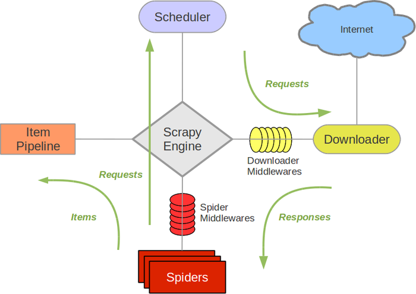

# 爬虫基于scrapy框架
# 流程

核心组件
spider:爬虫类
item:数据模型
pipeline:数据清洗，存储
middleware:中间件,处理请求和响应，用于设置代理，处理cookies。用户代理等
setting:配置文件，请求延迟、并发请求数等
# 项目结构
```py
myproject/
    scrapy.cfg            # 项目的配置文件
    cnkiproject/            # 项目源代码文件夹
        __init__.py
        items.py          # 定义抓取的数据结构
        middlewares.py    # 定义中间件
        pipelines.py      # 定义数据处理管道
        settings.py       # 项目的设置文件
        spiders/           # 存放爬虫代码的文件夹
            __init__.py
            myspider.py   # 自定义的爬虫代码
```
# 启动爬虫
```py
进入项目目录，scrapy crawl myspider
```

# 中间件 
在使用中间件前，必须在setting.py中注册
## 常见方法
### process_request(self,request,spider)
调用时机：在请求发送之前处理请求（下载器中间件）
用途：修改或补充request的属性（如headers,cookies,meta,proxy等）
可以返回：None，继续后续中间件和下载器处理；Response对象（跳过下载，直接把一个新的Response对象返回给spider。
注意：若此时直接返回response，scrapy就不会再去真正下载该请求，而是把你返回的Response当作`下载完成`交给spider处理
```py
return HtmlResponse(url=request.url, body=b'', request=request)
```
若返回新的reuqest,当前请求会被丢弃并重新走调度器，通常用于添加headers,cookies,代理。
### process_response(self,request,response,spider)
调用时机：当scrapy下载器接收到服务器response并准备交给spier处理之前
用途：检查和修改服务器返回的response（如根据状态码重新发送请求，替换成本地缓存，注入额外数据等）
可以返回：原始或修改过的Response，继续交给后续中间件或者Spider处理；新的Reuqest，取消当前响应，调度新的请求；抛出IgnoreRequest异常，跳过当前响应，继续交给后续中间件或者Spider处理。
# 配置飞书机器人与日常维护

