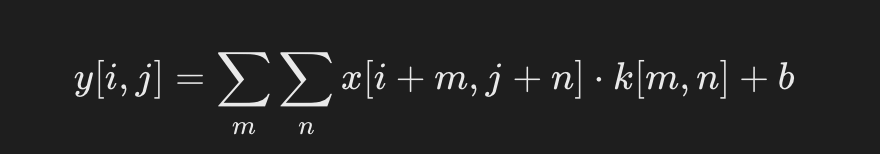
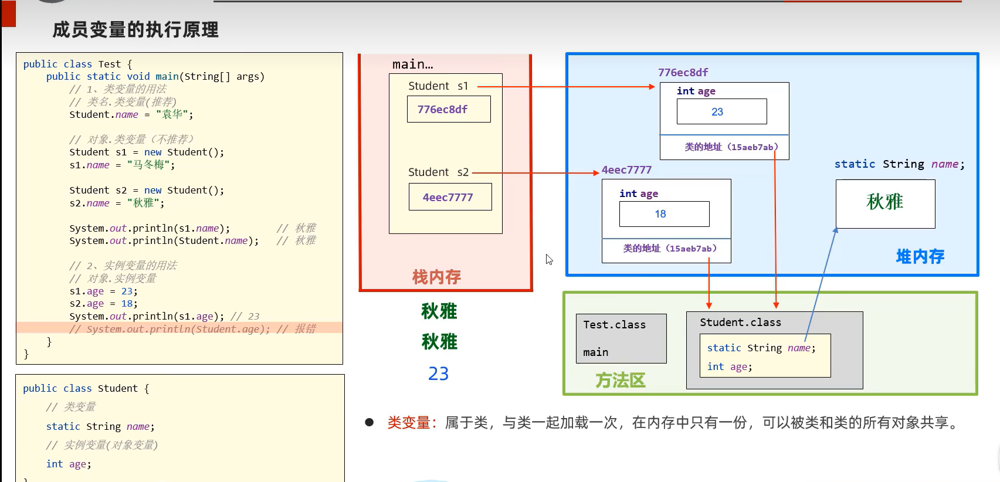

# pytorch
## pytorch基础
### 张量
用于存储和操作多维数组
#### 张量的创建
```python
import torch
a= torch.zeros(2,3)# 创建一个2x3的全0张量
print(a)

b=torch.ones(2,3)# 创建一个2x3的全1张量
print(b)

c=torch.randn(2,3)# 创建一个2x3的随机张量
print(c)

import numpy as np # 从numpy导入数据
numpy_array=np.array([[1,2,3],[4,5,6]])
tensor_from_numpy=torch.from_numpy(numpy_array)
print(tensor_from_numpy)

device=torch.device("cuda" if torch.cuda.is_available() else "cpu")# 在指定设备cpu/gpu创建
d=torch.randn(2,3,device=device)
print(d)
# 输出结果
tensor([[0., 0., 0.],
        [0., 0., 0.]])
tensor([[1., 1., 1.],
        [1., 1., 1.]])
tensor([[ 1.0189, -0.5718, -1.2814],
        [-0.5865,  1.0855,  1.1727]])
tensor([[1, 2],
        [3, 4]])
tensor([[-0.3360,  0.2203,  1.3463],
        [-0.5982, -0.2704,  0.5429]])
```
#### 常见张量操作
```py
import torch
# 张量相加
e = torch.randn(2, 3)
f = torch.randn(2, 3)
print(e + f)
# 逐元素乘法
print(e * f)
# 张量的转置
g = torch.randn(3, 2)
print(g.t())  # 或者 g.transpose(0, 1)
# 张量的形状
print(g.shape)  # 返回形状
```
### 张量与设备
```py
if torch.cuda.is_available():
    tensor_gpu = g.to('cuda')  # 将张量移动到GPU
```
### 神经网络基础
```py
import torch
import torch.nn as nn

# 定义一个简单的神经网络模型
class SimpleNN(nn.Module):
    def __init__(self):
        super(SimpleNN, self).__init__()
        # 定义一个输入层到隐藏层的全连接层
        self.fc1 = nn.Linear(2, 2)  # 输入 2 个特征，输出 2 个特征
        # 定义一个隐藏层到输出层的全连接层
        self.fc2 = nn.Linear(2, 1)  # 输入 2 个特征，输出 1 个预测值
    
    def forward(self, x):
        # 前向传播过程
        x = torch.relu(self.fc1(x))  # 使用 ReLU 激活函数
        x = self.fc2(x)  # 输出层
        return x

# 创建模型实例
model = SimpleNN()

# 打印模型
print(model)
```
#### 训练过程
1. 准备数据
2. 定义损失函数和优化器
3. 向前传播
4. 计算损失
5. 反向传播
6. 更新参数
7. 重复
### 第一个神经网络
```py
import torch
import torch.nn as nn
import torch.optim as optim
import matplotlib.pyplot as plt

# 生成一些随机数据
n_samples = 100
data = torch.randn(n_samples, 2)  # 生成 100 个二维数据点
labels = (data[:, 0]**2 + data[:, 1]**2 < 1).float().unsqueeze(1)  # 点在圆内为1，圆外为0

# 可视化数据
plt.scatter(data[:, 0], data[:, 1], c=labels.squeeze(), cmap='coolwarm')
plt.title("Generated Data")
plt.xlabel("Feature 1")
plt.ylabel("Feature 2")
plt.show()

# 定义前馈神经网络
class SimpleNN(nn.Module):
    def __init__(self):
        super(SimpleNN, self).__init__()
        # 定义神经网络的层
        self.fc1 = nn.Linear(2, 4)  # 输入层有 2 个特征，隐藏层有 4 个神经元
        self.fc2 = nn.Linear(4, 1)  # 隐藏层输出到 1 个神经元（用于二分类）
        self.sigmoid = nn.Sigmoid()  # 二分类激活函数

    def forward(self, x):
        x = torch.relu(self.fc1(x))  # 使用 ReLU 激活函数
        x = self.sigmoid(self.fc2(x))  # 输出层使用 Sigmoid 激活函数
        return x

# 实例化模型
model = SimpleNN()

# 定义损失函数和优化器
criterion = nn.BCELoss()  # 二元交叉熵损失
optimizer = optim.SGD(model.parameters(), lr=0.1)  # 使用随机梯度下降优化器

# 训练
epochs = 100
for epoch in range(epochs):
    # 前向传播
    outputs = model(data)
    loss = criterion(outputs, labels)

    # 反向传播
    optimizer.zero_grad()
    loss.backward()
    optimizer.step()

    # 每 10 轮打印一次损失
    if (epoch + 1) % 10 == 0:
        print(f'Epoch [{epoch + 1}/{epochs}], Loss: {loss.item():.4f}')

# 可视化决策边界
def plot_decision_boundary(model, data):
    x_min, x_max = data[:, 0].min() - 1, data[:, 0].max() + 1
    y_min, y_max = data[:, 1].min() - 1, data[:, 1].max() + 1
    xx, yy = torch.meshgrid(torch.arange(x_min, x_max, 0.1), torch.arange(y_min, y_max, 0.1), indexing='ij')
    grid = torch.cat([xx.reshape(-1, 1), yy.reshape(-1, 1)], dim=1)
    predictions = model(grid).detach().numpy().reshape(xx.shape)
    plt.contourf(xx, yy, predictions, levels=[0, 0.5, 1], cmap='coolwarm', alpha=0.7)
    plt.scatter(data[:, 0], data[:, 1], c=labels.squeeze(), cmap='coolwarm', edgecolors='k')
    plt.title("Decision Boundary")
    plt.show()

plot_decision_boundary(model, data)
```
### 数据处理与加载
#### 自定义Dataset
```py
import torch
from torch.utils.data import Dataset

# 自定义数据集类
class MyDataset(Dataset):
    def __init__(self, X_data, Y_data):
        """
        初始化数据集，X_data 和 Y_data 是两个列表或数组
        X_data: 输入特征
        Y_data: 目标标签
        """
        self.X_data = X_data
        self.Y_data = Y_data

    def __len__(self):
        """返回数据集的大小"""
        return len(self.X_data)

    def __getitem__(self, idx):
        """返回指定索引的数据"""
        x = torch.tensor(self.X_data[idx], dtype=torch.float32)  # 转换为 Tensor
        y = torch.tensor(self.Y_data[idx], dtype=torch.float32)
        return x, y

# 示例数据
X_data = [[1, 2], [3, 4], [5, 6], [7, 8]]  # 输入特征
Y_data = [1, 0, 1, 0]  # 目标标签

# 创建数据集实例
dataset = MyDataset(X_data, Y_data)
```
#### 使用DataLoader加载数据
```py
from torch.utils.data import DataLoader  # 从 PyTorch 导入 DataLoader 类，用于批量加载数据

# 创建 DataLoader 实例，传入之前定义好的 dataset，
# batch_size=2 表示每个批次加载2个样本，
# shuffle=True 表示在每个epoch开始前将数据打乱
dataloader = DataLoader(dataset, batch_size=2, shuffle=True)

# 进行1个epoch的循环，这里 range(1) 表示只训练1轮
for epoch in range(1):
    # 遍历 DataLoader 返回的批次，每个 batch 包含 inputs 和 labels
    # batch_idx 是当前批次的索引（从0开始）
    for batch_idx, (inputs, labels) in enumerate(dataloader):
        # 打印当前批次编号（从1开始显示）
        print(f'Batch {batch_idx + 1}:')
        # 打印当前批次的输入数据 inputs
        print(f'Inputs: {inputs}')
        # 打印当前批次的标签数据 labels
        print(f'Labels: {labels}')
```
✅ shuffle=True
表示在每个 epoch 开始之前，DataLoader 会先把你定义的 dataset 整体打乱（随机洗牌）。
✅ batch_size=2
表示 DataLoader 会把打乱后的数据 按2个样本一组 分成一个个 batch。
✅ 所以
每次训练时，DataLoader 会：
1️⃣ 先把你的 dataset 打乱顺序；
2️⃣ 再把打乱后的样本按 batch_size=2 分批；
3️⃣ 你在循环里一次次从 DataLoader 中拿到批次（inputs, labels）。
#### 预处理与数据增强
transforms
### 线性回归
```py
import torch
import numpy as np
import matplotlib.pyplot as plt
import torch.nn as nn
# 随机种子，确保每次运行结果一致
torch.manual_seed(42)

# 生成训练数据
X = torch.randn(100, 2)  # 100 个样本，每个样本 2 个特征
true_w = torch.tensor([2.0, 3.0])  # 假设真实权重
true_b = 4.0  # 偏置项
Y = X @ true_w + true_b + torch.randn(100) * 0.1  # 加入一些噪声


# 定义线性回归模型
class LinearRegressionModel(nn.Module):
    def __init__(self):
        super(LinearRegressionModel, self).__init__()
        # 定义一个线性层，输入为2个特征，输出为1个预测值
        self.linear = nn.Linear(2, 1)  # 输入维度2，输出维度1

    def forward(self, x):
        return self.linear(x)  # 前向传播，返回预测结果


# 创建模型实例
model = LinearRegressionModel()
# 损失函数（均方误差）
criterion = nn.MSELoss()

# 优化器（使用 SGD 或 Adam）
optimizer = torch.optim.SGD(model.parameters(), lr=0.01)  # 学习率设置为0.01
# 训练模型
num_epochs = 1000  # 训练 1000 轮
for epoch in range(num_epochs):
    model.train()  # 设置模型为训练模式

    # 前向传播
    predictions = model(X)  # 模型输出预测值
    loss = criterion(predictions.squeeze(), Y)  # 计算损失（注意预测值需要压缩为1D）

    # 反向传播
    optimizer.zero_grad()  # 清空之前的梯度
    loss.backward()  # 计算梯度
    optimizer.step()  # 更新模型参数

    # 打印损失
    if (epoch + 1) % 100 == 0:
        print(f'Epoch [{epoch + 1}/1000], Loss: {loss.item():.4f}')

# 查看训练后的权重和偏置
print(f'Predicted weight: {model.linear.weight.data.numpy()}')
print(f'Predicted bias: {model.linear.bias.data.numpy()}')

# 在新数据上做预测
with torch.no_grad():  # 评估时不需要计算梯度
    predictions = model(X)

# 可视化预测与实际值
plt.scatter(X[:, 0], Y, color='blue', label='True values')
plt.scatter(X[:, 0], predictions, color='red', label='Predictions')
plt.legend()
plt.show()
```
### 卷积神经网络CNN
#### 基本概念
1. 输入图像：网络接受的原始图像数据
2. 卷积：使用卷积核在输入图像上滑动，提取特征，生成特征图
3. 池化：通常在卷积层之后，通过最大池化或平均池化减少特征图的尺寸，同样保留重要特征，生成池化特征图
4. 特征提取：通过多个卷积和池化层的组合，逐步提取图像的高级特征。
5. 扁平层：将多维的特征图转换为一维向量，以便输入到全连接层。
6. 全连接层：类似于传统的神经网络，用于将提取的特征映射到输出类别。
7. 分类：网络的输出层，根据全连接层的输出进行分类。
8. 概率分布：输出层给出每个类别的概率，表示输入图像属于各个类别的可能性。
#### 基本结构
1. 输入层
   接收原始图像数据，图像通常被表示为一个三维数组，其中两个维度代表图像的宽度和高度，第三个维度代表颜色通道（RGB），
2. 卷积层
   用卷积核提取局部特征，如边缘，纹理等。
   公式：
   
   
3. 激活函数
   通常在卷积层之后应用非线性激活函数，如RELU，以引入非先行特性，使网络能够学习更复杂的模式
4. 池化层
   用于降低特征图的空间维度，减少计算量和参数数量，同时保留最重要的特征信息。
   最常见的池化操作是最大池化和平均池化。最大池化选择区域内的最大值，而平均池化计算区域内的平均值。
5. 归一化
   通常在卷积层之后应用归一化层，以加速训练过程并提高模型的泛化能力。
6. 全连接层
   在CNN的末端，将前面层提取的特征图展平成一维向量，然后输入到全连接层
   全连接层的每个神经元都与前一层的所有神经元相连，用于综合特征并进行分类或回归。
7. 输出层
8. 损失函数
9. 优化器
10. 正则化
#### Pytorch实现CNN
```py
import torch
import torch.nn as nn
import torch.nn.functional as F
import torch.optim as optim
from torchvision import datasets, transforms
import matplotlib.pyplot as plt

# 1. 数据加载与预处理
transform = transforms.Compose([
    transforms.ToTensor(),  # 转为张量
    transforms.Normalize((0.5,), (0.5,))  # 归一化到 [-1, 1]
])

# 加载 MNIST 数据集
train_dataset = datasets.MNIST(root='./data', train=True, transform=transform, download=True)
test_dataset = datasets.MNIST(root='./data', train=False, transform=transform, download=True)

train_loader = torch.utils.data.DataLoader(dataset=train_dataset, batch_size=64, shuffle=True)
test_loader = torch.utils.data.DataLoader(dataset=test_dataset, batch_size=64, shuffle=False)

# 2. 定义 CNN 模型
class SimpleCNN(nn.Module):
    def __init__(self):
        super(SimpleCNN, self).__init__()
        # 定义卷积层
        self.conv1 = nn.Conv2d(1, 32, kernel_size=3, stride=1, padding=1)  # 输入1通道，输出32通道
        self.conv2 = nn.Conv2d(32, 64, kernel_size=3, stride=1, padding=1)  # 输入32通道，输出64通道
        # 定义全连接层
        self.fc1 = nn.Linear(64 * 7 * 7, 128)  # 展平后输入到全连接层
        self.fc2 = nn.Linear(128, 10)  # 10 个类别

    def forward(self, x):
        x = F.relu(self.conv1(x))  # 第一层卷积 + ReLU
        x = F.max_pool2d(x, 2)     # 最大池化
        x = F.relu(self.conv2(x))  # 第二层卷积 + ReLU
        x = F.max_pool2d(x, 2)     # 最大池化
        x = x.view(-1, 64 * 7 * 7) # 展平
        x = F.relu(self.fc1(x))    # 全连接层 + ReLU
        x = self.fc2(x)            # 最后一层输出
        return x

# 创建模型实例
model = SimpleCNN()

# 3. 定义损失函数与优化器
criterion = nn.CrossEntropyLoss()  # 多分类交叉熵损失
optimizer = optim.SGD(model.parameters(), lr=0.01, momentum=0.9)

# 4. 模型训练
num_epochs = 5
model.train()  # 设置模型为训练模式

for epoch in range(num_epochs):
    total_loss = 0
    for images, labels in train_loader:
        outputs = model(images)  # 前向传播
        loss = criterion(outputs, labels)  # 计算损失

        optimizer.zero_grad()  # 清空梯度
        loss.backward()  # 反向传播
        optimizer.step()  # 更新参数

        total_loss += loss.item()

    print(f"Epoch [{epoch+1}/{num_epochs}], Loss: {total_loss / len(train_loader):.4f}")

# 5. 模型测试
model.eval()  # 设置模型为评估模式
correct = 0
total = 0

with torch.no_grad():  # 关闭梯度计算
    for images, labels in test_loader:
        outputs = model(images)
        _, predicted = torch.max(outputs, 1)
        total += labels.size(0)
        correct += (predicted == labels).sum().item()

accuracy = 100 * correct / total
print(f"Test Accuracy: {accuracy:.2f}%")

# 6. 可视化测试结果
dataiter = iter(test_loader)
images, labels = next(dataiter)
outputs = model(images)
_, predictions = torch.max(outputs, 1)

fig, axes = plt.subplots(1, 6, figsize=(12, 4))
for i in range(6):
    axes[i].imshow(images[i][0], cmap='gray')
    axes[i].set_title(f"Label: {labels[i]}\nPred: {predictions[i]}")
    axes[i].axis('off')
plt.show()
```