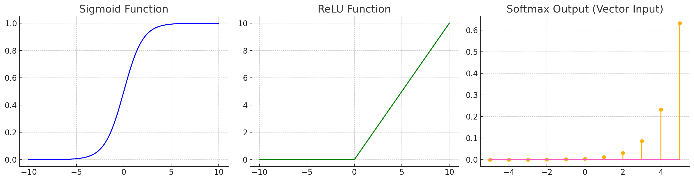

# 09softamx回归
## softmax sigmoid relu区别
| 名称      | 公式                             | 输出范围        | 用途     | 缺点/问题       |
| ------- | ------------------------------ | ----------- | ------ | ----------- |
| Sigmoid | $\frac{1}{1 + e^{-x}}$         | (0, 1)      | 二分类输出层 | 梯度消失、输出非零均值 |
| Softmax | $\frac{e^{z_i}}{\sum e^{z_j}}$ | (0, 1)，总和为1 | 多分类输出层 | 各输出耦合，非稀疏   |
| ReLU    | $\max(0, x)$                   | \[0, ∞)     | 隐藏层    | 神经元可能“死亡”   |


```py
import torch

import torchvision

from torch.utils import data

from torchvision import transforms

import pandas as pd


def load_data_fashion_mnist(batch_size):
    '''技巧：及时封装以前的函数，避免出现代码堆积，是一个值得学习的好习惯'''

    # 使用totensor将图像从PIL类型转换为32位数浮点,并且会自动除以255归一化至[0,1]

    trans = transforms.ToTensor()

    mnist_train = torchvision.datasets.FashionMNIST(root='./data', train=True, transform=trans,
                                                    download=True)  # train为True表示下载训练集

    mnist_test = torchvision.datasets.FashionMNIST(root='./data', train=False, transform=trans, download=True)

    return (data.DataLoader(mnist_train, batch_size, True, num_workers=0),
            data.DataLoader(mnist_test, batch_size, True, num_workers=0))


batch_size = 256  # 每次读取256批次图片

train_iter, test_iter = load_data_fashion_mnist(batch_size)  # 获取两个dataloader

#2.展平图像与初始化参数视为28 * 28 = 784的向量，故输入是784，由于数据集有10个类别，所以网络输出维度是10

num_inputs = 784

num_outputs = 10

W = torch.normal(0, 0.01, size=(num_inputs, num_outputs), requires_grad=True)  # 权重矩阵784x10

b = torch.zeros(num_outputs, requires_grad=True)  # 偏差矩阵 10x1

#3.定义softmax算符：这里要掌握张量计算的方法当调⽤sum运算符时，
# 我们可以指定保持在原始张量的轴数，⽽不折叠求和的维度，如对(3, 2)进行按列求和，会得到(2, )，
# 设置keepdim为True就是(1, 2)即一行，分别是两列的和


def softmax(X):#x=[batch, in_features]
    X_exp = torch.exp(X)  # 对每个元素进行指数计算 这里X输入是

    partition = X_exp.sum(1, keepdim=True)  # 这里是对行求和，获得的是每行的和 partition=[[],[]]

    return X_exp / partition


#4.定义模型

#1.例如batch_size = 256，则X这里是(256, 784)代表256张图片每个图片有28x28个像素（被展平成784）

#2.权重矩阵为(784, 10)代表对每种输出的各特征权重

#3.因此256x784 @ 784x10 == 256x10即每张图片会输出十个类别的置信度，如衣服20 % T恤60 %……大衣5 %，对十个输出会加上一个bias，通过广播机制作用到所有图片


def net(X):
    return softmax(torch.matmul(X.reshape((-1, W.shape[0])), W) + b)


#定义交叉熵损失 交叉熵只在意真实值的预测概率, 因此这里是抽取每一行对应是真实类别的预测概率的那个值，拿出来求负对数

#例如第一个样本应该是2类（设共三类，从0 - 2），并预测概率是0.7，第二个样本应该是1类，预测是1类概率为0.5，则交叉熵损失为

#-log(0.7)和 - log(0.5)

def cross_entropy(y_pred, y_true):
    return -torch.log(y_pred[range(len(y_pred)), y_true])  # 这里必须用range，相当于遍历每行，对该行找对应的那个类的预测概率


# 如果用y_pred[:,y_true] 相当于返回指定的列，而不是概率

#计算准确率

def accuracy(y_pred, y_true):
    '''计算准确率'''

    if len(y_pred.shape) > 1 and y_pred.shape[1] > 1:
        '''如果其是二维数组，即行数大于一（多个样本），且有多列（多分类）'''

        y_pred = y_pred.argmax(axis=1)  # 对每行获取其最大值的索引

    result = (y_pred == y_true)  # 在对应位置比较是否预测正确，比如[2,3,4],[2,3,5]结果就是[True,True,False]

    return result.sum()


#评估在任意模型上的准确率


def evaluate_accuracy(net, data_iter):
    '''计算模型在指定数据集上的模型精度'''

    if isinstance(net, torch.nn.Module):
        net.eval()  # 设置为评估模式

    metric = Accumulator(2)  # 正确预测数，预测总数

    for X, y in data_iter:  # 这里y是对应的类别标签，因此后面numel实际是返回了这批样本个数

        metric.add(accuracy(net(X), y), y.numel())  # numel number of element 返回元素总数，例如2x3矩阵返回就是6个元素

        # 这里表示把这批样本预测的正确率和个数累加到accumulator中

    return metric[0] / metric[1]  # 预测正确数除以预测总数


# --------------实现accumulator-------------------

class Accumulator:

    def __init__(self, n) -> None:
        self.data = [0.0] * n

    def add(self, *args):
        self.data = [a + float(b) for a, b in zip(self.data, args)]  # 其实就是准确率相加 样本个数相加

        # 如 (0.5,6)+(0.2,8)-->(0.7,14)

    def reset(self):
        self.data = [0.0] * len(self.data)

    def __getitem__(self, idx):
        return self.data[idx]  # 定义方括号索引


#回归训练和可视化


def train_epoch_ch3(net, train_iter, loss, updater):
    """训练模型⼀个迭代周期（定义⻅第3章） """

    # 将模型设置为训练模式

    if isinstance(net, torch.nn.Module):
        net.train()  # 开启训练模式

    # 累计训练损失总和、训练准确度总和、样本数

    metric = Accumulator(3)

    for X, y in train_iter:
        # 计算梯度并更新参数

        y_hat = net(X)  # 计算预测值

        l = loss(y_hat, y)  # 交叉熵损失函数计算损失

    if isinstance(updater, torch.optim.Optimizer):

        # 使⽤PyTorch内置的优化器和损失函数

        updater.zero_grad()  # 例如小批量随机梯度下降，需要手动清空梯度

        l.mean().backward()

        updater.step()

    else:

        # 使⽤定制的优化器和损失函数

        l.sum().backward()

        updater(X.shape[0])  # 根据批次大小update

    metric.add(float(l.sum()), accuracy(y_hat, y), y.numel())

    # 返回训练损失和训练精度，即损失值除以训练样本数和精度处于训练样本数

    return metric[0] / metric[2], metric[1] / metric[2]


def train_ch3(net, train_iter, test_iter, loss, num_epochs, updater):  # @save

    """训练模型（定义⻅第3章） """

    result = []  # 记录损失，训练集精度，验证集精度

    for epoch in range(num_epochs):
        train_metrics = train_epoch_ch3(net, train_iter, loss, updater)  # 返回训练损失和训练精度

        test_acc = evaluate_accuracy(net, test_iter)  # 在验证集上的精度

        result.append([train_metrics[0], train_metrics[1], test_acc])

    result_df = pd.DataFrame(result, columns=['train loss', 'train accuracy', 'test accuracy'],
                             index=range(1, len(result) + 1))

    result_df.plot(xlabel='epoch', title='Softmax Regression Result')

    return result_df


def stochastic_gradient_descent(params, eta, batch_size):
    '''小批量随机梯度下降'''

    with torch.no_grad():  # 更新时不参与梯度计算

        for param in params:
            param -= eta * param.grad / batch_size  # 和公式相同

            param.grad.zero_()  # 清除梯度（避免累计梯度）


def updater(batch_size):
    return stochastic_gradient_descent([W, b], lr, batch_size)

if __name__ == "__main__":
    lr = 0.1
    num_epochs = 10
    result = train_ch3(net, train_iter, test_iter, cross_entropy, num_epochs, updater)

```
# 10.感知机