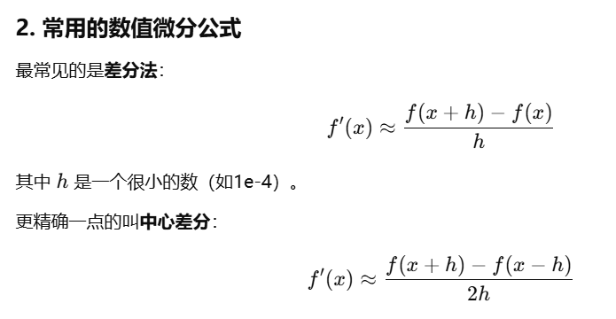
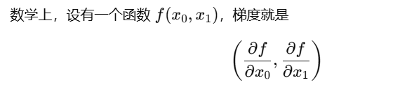
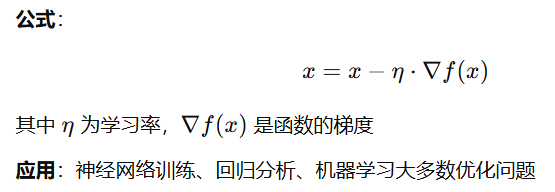
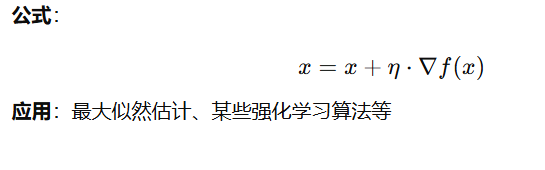

# 向前传播与反向传播
向前传播：是指沿着计算图（或网络层）从输入到输出的信号传递过程。具体来说，就是将输入数据依次经过各层的线性变换（如全连接层的a=xw+b）和激活函数（如sigmoid,relu,softmax），最终在输出层得到模型的预测结果。这一步仅设计向前计算，不对参数做任何修改，是推理（inferencd）的核心流程。
反向传播：是指从输出层（通常是损失函数的结果）沿着计算图的反方向，利用链式法则将误差信号（梯度）逐层传递回去的过程，在每个节点，根据该节点的局部导数将上游传来的梯度乘以相应系数，再传给下游（前一层），从而累积得到对各参数（权重，偏置）的梯度，用于随后参数更新。 
# 手写数字识别
```py
import pickle
import numpy as np
from dataset.mnist import load_mnist
from common.functions import sigmoid, softmax

def get_data():
    (x_train, t_train), (x_test, t_test) = \
        load_mnist(normalize=True, flatten=True, one_hot_label=False)
    return x_test, t_test

def init_network():
    with open("sample_weight.pkl", 'rb') as f:
        network = pickle.load(f)
    return network

def predict(network, x):
    W1, W2, W3 = network['W1'], network['W2'], network['W3']
    b1, b2, b3 = network['b1'], network['b2'], network['b3']

    a1 = np.dot(x, W1) + b1
    z1 = sigmoid(a1)
    a2 = np.dot(z1, W2) + b2
    z2 = sigmoid(a2)
    a3 = np.dot(z2, W3) + b3
    y  = softmax(a3)
    return y
x, t = get_data()
network = init_network()

accuracy_cnt = 0
for i in range(len(x)):
    y = predict(network, x[i])
    p = np.argmax(y)           # 预测标签
    if p == t[i]:
        accuracy_cnt += 1

print("Accuracy:" + str(float(accuracy_cnt) / len(x)))

```
## 为什么用测试集，而不是训练集？
训练集用于学习，即通过反向传播更新权重
测试集用于评估，即通过测试集评估模型性能，如准确率，召回率等。
## normalize是什么？
True时会把像素从0~255映射到0~1之间，即归一化。稳定训练和推理中的数值计算。
## flatten是什么？
将原本形状为 (1, 28, 28) 的三维数组“展平”成长度为 784 的一维向量，方便与全连接层的权重矩阵相乘；

## one_hot_label是什么？
True时，标签数据会变成仅包含0或1的向量，如标签为3时，标签向量会变成[0,0,0,1,0,0,0,0,0,0]。

## 为什么用pickle？
pickle模块实现了基本的数据序列和反序列化。通过pickle模块的序列化操作我们能够将程序中运行的对象信息保存到文件中去，永久存储；通过pickle模块的反序列化操作，我们能够从文件中创建上一次程序保存的对象。
## 为什么用sigmoid函数？
sigmoid函数是连续可导的，而ReLU函数在x=0处不可导，因此使用sigmoid函数作为激活函数。
## 为什么用softmax函数？
softmax函数将输出值变换成0~1之间的概率值，可以用于多分类问题。
## 为什么if p==t[i]时就说明预测准确？
p = np.argmax(y) 取出 y 中概率最高的下标，也就是模型认为最可能的类别；
t[i] 是该样本的真实标签（一个整数）；
当它们相等时，说明“模型预测的类别”正好和“真实标签”吻合，算一次正确分类。累计正确次数后除以样本总数，就是分类准确率。
# 批处理
```py
x, t = get_data()
network = init_network()

batch_size = 100  # 每个批次的图像数量
accuracy_cnt = 0

# 按 batch_size 为步长，生成批的起始索引
for i in range(0, len(x), batch_size):
    # —— 取出从 i 到 i+batch_size 的这一段图像，形状为 (batch_size, 784)
    x_batch = x[i:i+batch_size]
    # —— 将整个批一次性送入 predict，得到形状 (batch_size, 10) 的概率数组
    y_batch = predict(network, x_batch)
    # —— 在第 1 维（每行）上取最大值的索引，得到形状 (batch_size,) 的预测标签
    p = np.argmax(y_batch, axis=1)
    # —— 直接比较向量 p 与标签 t[i:i+batch_size]，True 计 1，累加正确数
    accuracy_cnt += np.sum(p == t[i:i+batch_size])

print("Accuracy:" + str(float(accuracy_cnt) / len(x)))

```
## 为什么批处理能够加速？
减少 Python 层的循环开销
单张图片推理时，每一次都要从 Python 进入 NumPy 做一次矩阵运算，来回切换消耗较大；批处理只需一次函数调用，就能在底层一次性完成对整个批次的矩阵乘加运算。

充分利用向量化和底层优化
NumPy 底层调用了经过高度优化的 BLAS／LAPACK 库，能对大块连续内存做并行化 SIMD 运算和多线程并行，批量矩阵运算比多次小矩阵运算更能命中缓存、减少内存访问延迟。

降低调度与内存分配开销
批量操作时只分配一次输出数组，减少了多次分配、释放临时数组的成本。
# 如果只靠“数据驱动”，有没有可能学出一些奇怪但有效的“特征”?
模型可能学到“数据偏差”。举例：如果训练集里所有“5”后面都有模糊的阴影，而其他数字没有，网络就可能把“阴影”当作识别“5”的信号。
补充：这就是为什么要保证训练数据多样性、避免标签偏差，并在训练时加上正则化（如 Dropout）、数据增强（如随机旋转、裁剪）来减少这些“歧义特征”对模型的影响。
# 神经网络最大特点
可以从数据中自动学习参数（如权重），不像之前感知机那样全靠人工设定。
# 训练数据和测试数据
机器学习中，一般将数据分为训练数据和测试数据两部分。首先，先用训练数据进行学习，寻找最优的参数；然后，使用测试数据评价训练得到的模型的时机能力。我们追求的是模型的泛化能力。为了中恩却评价模型的泛化能力，就必须分为训练数据和测试数据。训练数据也可以成为监督数据。
泛化能力是指处理未被训练过的数据的能力。泛化能力也是机器学习。
# 过拟合
过拟合就是模型太依赖训练数据，甚至把一些偶然因素都当作特征学了进去，进而模型只学会了“记忆”训练集，而没有学到能推广到新数据的能力。
# 损失函数
## 损失函数的作用
衡量模型输出与真是答案之间的差距。神经网络的学习目标：通过不断调整参数，让损失函数的值最小。损失函数值越大，说明模型的表现越差。
## 均方误差（MSE）：适用于回归问题或输出为概率时。

## 交叉熵误差：最常用于分类问题

## mini-batch学习
机器学习是，严格来说损失函数应该对全部训练数据计算。但是对于数据量大时，每次全量计算太慢。所以引入mini-batch机制。每次随机抽取一小批数据，如100条，来近似整体损失。计算方式：对mini-batch里的每个样本算损失，然后取平均值作为这一批损失。
### mini-batch版交叉熵误差实现
```python
import numpy as np

def cross_entropy_error(y, t):
    # 1. 如果输入y是一维的（单样本），就把它扩展成二维（batch, 类别数），以便后续代码统一处理
    if y.ndim == 1:  
        t = t.reshape(1, t.size)   # t变成(1, 类别数)
        y = y.reshape(1, y.size)   # y变成(1, 类别数)
        
    # 2. 得到batch的大小（即有多少个样本）
    batch_size = y.shape[0]
    
    # 3. 计算交叉熵损失
    #    t * np.log(y + 1e-7) 对于one-hot标签，只会在“真实类别”那个位置有值（其余都是0）
    #    np.sum(…) 是把所有样本所有类别的损失累加
    #    最后除以batch_size，得到平均每个样本的损失
    #    加1e-7是为了避免log(0)出现负无穷
    return -np.sum(t * np.log(y + 1e-7)) / batch_size

```
# 数值微分


# 梯度
梯度就是多元函数各个方向偏导数的集合。

在深度学习优化参数时，我们需要让损失函数下降最快，也就是沿梯度的反方向走
## 梯度法
梯度法就是沿着损失函数下降最快的方向，不断调整参数，让模型表现越来越好的方法
### 梯度下降法
目标是找到函数的最小值（如让损失函数最小化）
每次都沿着梯度的翻方向更新参数

```python
import numpy as np
def numerical_gradient(f,x):
    h=1e-4
    grad = np.zeros_like(x)# 生成和x形状相同的数组
    for idx in range(x.size):
        tmp_val = x[idx]
        x[idx] = float(tmp_val) + h
        fxh1 = f(x)
        x[idx] = tmp_val - h
        fxh2 = f(x)
        grad[idx] = (fxh1 - fxh2) / (2*h)
        x[idx] = tmp_val
    return grad

def gradient_descent(f,init_x,lr=0.01,step_num=100):
    x = init_x
    for i in range(step_num):
        grad = numerical_gradient(f,x)
        x -= lr*grad
    return x
```
### 梯度上升法
目标是找到函数的最大值（如让准确率最大化）
每次都沿着梯度的反方向更新参数

### 学习率
学习率控制着每次参数更新的步伐的大小，即x=x-n*grad
太大：每次跨太远，容易跳过最优点，甚至导致损失震荡，无法收敛。
太小：每次只走一小步，训练非常慢，容易现在局部。
### 神经网络的梯度
1. 定义神经网络(simpleNet类)
```py
import numpy as np
from common.functions import softmax, cross_entropy_error
from common.gradient import numerical_gradient

class simpleNet:
    def __init__(self):
        self.W = np.random.randn(2, 3)  # 初始化权重矩阵，形状2行3列

    def predict(self, x):
        return np.dot(x, self.W)
#x是输入向量，形状为(2,)
#np.dot(x, self.W) 计算输入x和权重W的点积，结果是一个长度为3的向量（对3个类别的分数）
    def loss(self, x, t):
        z = self.predict(x)
        y = softmax(z)
        loss = cross_entropy_error(y, t)
        return loss
# z=self.predict(x) 得到网络输出(3个类别的分数)
# y=softmax(z)把分数变成概率(概率和为1)
# loss=cross_entropy_error(y, t) 计算交叉熵损失，衡量预测概率和真是标签的差距
#返回损失值，越少与好
```
问题1：可以用(1,2)吗？还是说必须(2,)。
答：（1，2）相当于一个batch,有一个样本，2个特征
问题2：2x3表示什么？
答：这个网络的权重w是2行3列的矩阵。2代表输入特征数量，3代表输出神经元数量
2. 求梯度的过程（关键）
```py
net = simpleNet()# 实例化网络
x=np.array([0.6, 0.9])# 输入
t=np.array([0, 0, 1])# 真实标签,one-hot编码

def f(W):
    return net.loss(x, t) # 定义一个“损失关于w的函数”
    
dW = numerical_gradient(f, net.W) # 计算梯度
print(dW)
```

