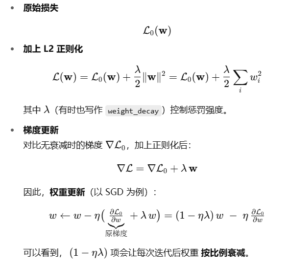

# 一. 感知机(Perceptron)&多层感知机(MLP)
1. 是什么？
   感知机：最简单的线性二分模型，模型形式y=sign=(Wx+b)。
   MLP:由若干个仿射层(Affine)+激活函数层串联而成的深度网络
2. 作用
   感知机：二分类模型，用于线性可分数据集的分类
   MLP：多分类模型，用于线性不可分数据集的分类
3. 优缺点
   感知机：优点：模型简单，易于实现；缺点：只能处理线性可分数据集，无法处理线性不可分数据集
   MLP：优点：可以处理线性不可分数据集；缺点：模型复杂，难以实现
4. 与神经网络的关系
   感知机是神经网络的前身，感知机是单层神经网络，MLP是多层神经网络
5. 怎么用：
   1. 定义若干层：x->affine->relu->affine->relu->affine->softmax
   2. 前向计算得到预测
   3. 计算损失->反向传播->更新参数
# 反向传播算法(Backpropagation)
1. 是什么？
   基于链式法则，高效地把最终损失对每层参数的梯度进行计算，从输出端反向传回各层
2. 作用
    让神经网络自动算出每个权重w,b的梯度，从而可用梯度下降法更新参数。
3. 怎么用：
   1. 定义损失函数：loss=loss(y,y_hat)
   2. 定义反向传播函数：loss.backward()
   3. 更新参数：w-=lr*dw,b-=lr*db
# 激活函数(Activation Function)
1. 是什么？
   激活函数：对神经网络节点的输出进行非线性变换的函数，常用于神经网络中。
2. 作用
   1. 使神经网络可以拟合任意函数
   2. 使神经网络可以解决非线性问题
3. 常用激活函数
   1. ReLU：f(x)=max(0,x) 引入非线性，避免梯度消失，计算简单，收敛快。
   2. Sigmoid：f(x)=1/(1+exp(-x)) 输出范围(0,1)，适合二分类概率；易饱和，梯度消失，深层网络少用
   3. Softmax：f(x)=exp(x)/sum(exp(x)) 输出范围(0,1)，适合多分类概率；通常搭配交叉熵损失一起使用，数值更稳定
# 损失函数
1. 是什么？
   损失函数：用于评价模型预测值与真实值之间的误差，从而指导模型优化。
2. 作用
   1. 指导模型更新参数，使模型输出更接近真实值
   2. 评价模型好坏，指导模型调优
3. 常用损失函数
    1. CrossEntropyLoss：交叉熵损失，用于多分类问题，常搭配Softmax激活函数一起使用。
    2. MSELoss：均方误差损失，用于回归问题。

# Epoch
比如：数据集有10000调样本,Batch有100个样本，那么训练100次，就叫做1个epoch。
# 经典神经网络从头到尾的训练和推理流程。
1. 收集数据
        图像，文本，表格，根据任务准备原始样本和对应标签
2. 预处理
        归一化/标准变化，裁剪/填充，数据增强（反转，噪声）
        构造Mini-Batch，随机打乱，批处理
3. 定义网络结构
        按照Affine->激活->Affine->softmax设计各层维度
        选择激活函数和损失函数
4. 初始化参数
        随机初始化参数
5. 训练
   对于每个Epoch（遍历全量数据一次）
   1. 前向传播，得到预测值
      1. 对于每个Batch
        Affine层Z=XW+b
        激活层A=激活函数f(Z)
        最后一层用Softmax
   2. 计算损失
        1. 用交叉熵等恒联y与t的差距
   3. 反向传播
        从输出层开始，按链式法则计算每层的梯度。
   4. 更新参数，更新学习率
6. 验证与测试
   1. 验证集评估
      1. 用验证集评估模型效果，选择最优模型
   2. 测试集评估
      1. 用测试集评估模型效果，评估模型泛化能力
7. 部署
   1. 用训练好的模型预测新样本
# SDG
1. 是什么？
   SGD：随机梯度下降，每次迭代随机抽取一个样本，计算梯度，更新参数。
2. 公式
   w=w-lr*dw
# Momentum
1. 是什么？
Momentum（动量）是在 SGD 基础上引入“惯性”概念的优化器，它不仅依赖当前梯度，还结合了过去梯度的移动平均。
2. 公式
    v=beta*v+(1-beta)*dw
    w=w-lr*v
# AdaGrad
1. 是什么？
    AdaGrad（自适应梯度）是一种自适应学习率算法，它根据每个参数的历史梯度值，动态调整学习率。
2. 公式
    s=s+dw^2  (s是历史梯度平方的累加)
    w=w-lr*dw/sqrt(s+eps)（ϵ≈1e−8 用来防止分母为 0）
# Adam
1. 是什么？
    Adam（自适应矩估计）是另一种自适应学习率算法，它结合了动量和自适应梯度算法的优点。
2. 公式
    m=beta1*m+(1-beta1)*dw
    v=beta2*v+(1-beta2)*dw^2
    m=m/(1-beta1^t)
    v=v/(1-beta2^t)
    w=w-lr*m/(sqrt(v)+eps)
# 权重初始值
   ## 权重初始值可以是0吗
      不能，因为权重初始值设为零，那么所有神经元的输出都是相同的，无法学习到不同的特征。梯度方向相同，无法分化
   ##  常用的初始化方法

# 梯度消失
    比如链式法则的连乘效应，可能会使导数接近零
# 过拟合
    模型在训练集上表现很好，但在测试集上表现很差，说明模型泛化能力差，无法适应新的数据。
1. 原因
    模型复杂度过高：参数过多、网络层数过深，容量大到能记住所有训练样本细节。
    训练数据量不足：样本太少，无法覆盖真实分布，全靠少量数据“拟合”出不具代表性的规则。
    噪声干扰：训练数据中含有标签错误或测量误差，模型把这些偶然性“当真”也学了进去。
2. 解决方法
   1. 正则化：在损失函数中加入模型复杂度的惩罚项，降低模型复杂度，从而降低过拟合风险。
   2. 数据增强：通过变换原始数据，生成更多新样本，从而增加训练数据量。
# Batch Normalization（需要补充）
1. 是什么？
   BN：在神经网络中引入BN层，对每个神经元输出进行归一化，从而加速收敛，提高模型泛化能力。
2. 作用
   1. 加速收敛：BN层对每个神经元输出进行归一化，使得输入的均值和方差更稳定，从而加速梯度下降的收敛速度。
   2. 提高泛化能力：BN层对每个神经元输出进行归一化，使得输入的均值和方差更稳定，从而使得模型对输入的扰动更具鲁棒性，提高模型泛化能力。
3. 公式
   1. 对每个神经元输出进行归一化：
     1. x=(x-mean(x))/sqrt(var(x)+eps)
   2. 对归一化后的输出进行缩放和平移：
     1. y=gamma*x+beta
# 正则化
## 权值衰减
   1. 是什么？
      神经网络学习的目的是减少损失函数的值，为损失函数加上权重的平方范数(L2正则化)。这样一来，就可以抑制权重变大，从而抑制过拟合。
   2. 原理
     
## Dropout
1. 是什么？
   Dropout：在神经网络中引入Dropout层，随机丢弃一部分神经元，从而减少模型复杂度，降低过拟合风险。
2. 作用
   1. 减少模型复杂度：Dropout层随机丢弃一部分神经元，使得模型复杂度降低，从而降低过拟合风险。
   2. 提高模型泛化能力：Dropout层随机丢弃一部分神经元，使得模型对输入的扰动更具鲁棒性，从而提高模型泛化能力。
# softmax sigmoid relu区别
| 名称      | 公式                             | 输出范围        | 用途     | 缺点/问题       |
| ------- | ------------------------------ | ----------- | ------ | ----------- |
| Sigmoid | $\frac{1}{1 + e^{-x}}$         | (0, 1)      | 二分类输出层 | 梯度消失、输出非零均值 |
| Softmax | $\frac{e^{z_i}}{\sum e^{z_j}}$ | (0, 1)，总和为1 | 多分类输出层 | 各输出耦合，非稀疏   |
| ReLU    | $\max(0, x)$                   | \[0, ∞)     | 隐藏层    | 神经元可能“死亡”   |

